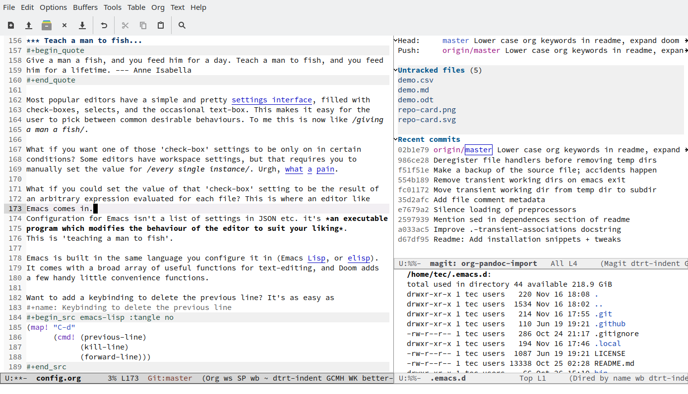
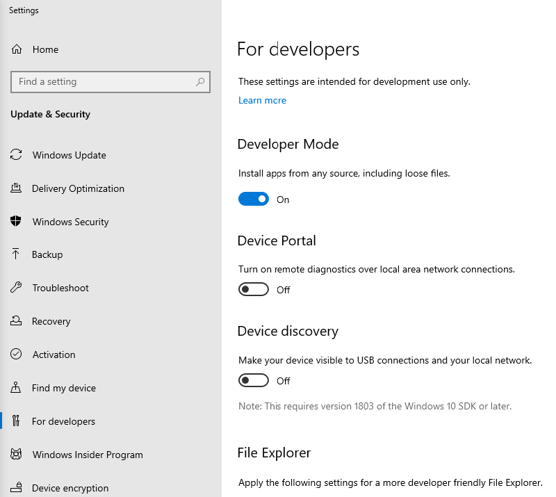

# Table of Contents

1.  [What is this?](#orgbfa8ea8)
2.  [How should you read?](#orgf9b4751)
3.  [How can you read more research papers?](#orgadaafbe)
4.  [Why are we using GitHub?](#org1601595)
5.  [What is version control?](#org09e57d7)
6.  [How should you use GitHub?](#orgc22d7c9)
7.  [What is a sprint review?](#orgb9028aa)
8.  [What do I need to deliver at a sprint review?](#org36f2f12)
9.  [What should we do in the first sprint?](#org5a17727)
10. [What should we do in the second sprint?](#org58c86f8)
11. [How do you report on and plan a research "method"?](#org4f7e8b5)
12. [What should we do in the third sprint?](#orgae37996)
13. [What should we do in the fourth sprint?](#org8f997bb)
14. [Where I can find out more about "IMRaD"?](#org6d09070)
15. [Which editor and IDE do you use?](#org21375b8)
16. [How can I install Emacs as a data science IDE on Windows 10?](#orge4a9d83)
17. [How to use GitHub Desktop to backup your code to GitHub](#orgafa03db)
18. [How can you always create a great presentation?](#org0facc12)
19. [How should we prepare for the final presentation?](#orgb7a6401)
20. [What do we have to deliver for the final essay or presentation?](#org43cca05)
21. [How is the final essay graded?](#orge08c1e8)
22. [What's the difference between an essay and an EDA report?](#org22e7f0d)
23. [How can I install Linux under Windows 10?](#orgd5bc3a7)
24. [How can I get Linux tools under Windows 10?](#org07501d9)
25. [How to install R under Windows and MacOS](#orga827b17)
26. [How to install a C compiler under Windows and MacOS](#org6c695fd)
27. [How to install SQLite under Windws and MacOS](#org9974b8d)
28. [How to install Emacs (+ESS) under Windows and MacOS](#org66cd145)
29. [How to customize GNU Emacs](#org23d6aa9)
30. [Completing the GitHub "hello world" exercise](#orgb993507)
31. [Why Emacs for Programming?](#orgd389e62)
32. [References](#org0f6f350)

# What is this?

This is a Frequently Asked Questions (FAQ) file for all my courses
at Lyon College. For individual FAQs, see the resp. course repos.

# How should you read?

There are different ways to read a demanding text. Since I
systematize everything, let me try to systematize this for you,
too - even though reading is quite a personal activity (involving,
for example, taste), I believe that it is useful to have a system
if your goal is to learn the most with the least effort<a id="fnr.1" class="footref" href="#fn.1">1</a>. In
the following, you can substitute "read" for "learn using media":
instead of a printed book, you can also use a digital book, a
podcast, or a video<a id="fnr.2" class="footref" href="#fn.2">2</a>. I can think of (1) skimming; (2) shallow
reading; (3) deep reading; (4) reading with notes; (5) reading with
props; (6) re-reading. What are these about?

1.  **Skimming**: quickly go over the material in an intuitive fashion
    to decide what to do with it later, or to get at least a basic
    idea of what's being said. For scientific papers: read abstract,
    then (if still interesting) go to the conclusions at the end.
    
    

2.  **Shallow reading:** read through the whole text slowly, without
    too many breaks<a id="fnr.3" class="footref" href="#fn.3">3</a>, in order to get a general picture and
    already identify areas of information (to answer questions like:
    am I too ignorant to understand this? What do I already know? How
    long will it take me to fully unlock this text? Will it be worth
    it?).

3.  **Deep reading:** Deep reading implies not taking breaks and
    holding the tension of not understanding. The only break that I
    allow myself for this mode of reading is to take my eyes off the
    text to think. The point is not to break concentration, because
    if you want to summon your full forces of association, you need
    to immerse yourself in the material. Deep reading almost always
    leaves me hungry for the next reading stage (reading with notes),
    or for reading something else too, or instead (e.g. if the text
    was inspiring and interesting, but just too hard to understand
    without working through it in its entirety).

4.  **Reading with notes:** This mode and the next are the most
    time-intensive ones. I employ them whenever I am working out a
    lecture, or practice exercises, or if I find something really
    hard of I am puzzled or stumped<a id="fnr.4" class="footref" href="#fn.4">4</a>. I find it important to
    write everything with long hand in a proper notebook (lined,
    21x31, softcover). I use a lovely fountain pen with black ink and
    a converter that I have to refill by hand). Writing in this
    notebook feels good and I like looking at my notes afterwards,
    which is important, even though most of these notes will never be
    looked at again: the point is not to duplicate the text but to
    get it into my head. I find that taking digital notes does not
    compare with analog notes. From all of this, you can discern that
    the way of taking notes is quite personal and cannot be part of
    the (universal) system. You may prefer to write with a pencil on
    individual sheets of yellow squared paper, or in a college block,
    or with a brush on hand-made Japanese paper. It doesn't matter.
    
    For example, here are two pages of "reading with notes" based on
    a series of four short videos in the Coursera course "[Model
    Thinking](https://www.coursera.org/learn/model-thinking/home/welcome)", which I used to prepare a lesson in a new course on
    "data modeling":
    
    

5.  **Reading with props:** Often, especially in computer science,
    writing about concepts, and making computations by hand, is not
    enough. I have to try stuff as I read<a id="fnr.5" class="footref" href="#fn.5">5</a> using props. The
    props lead to interactive (digital) notes rather than static
    (analog) ones. Any additional medium that I use (e.g. mindmaps,
    wiki, post-its, presentation) takes me away from the text and
    offers additional distractions - hence, I must have a really good
    reason to do this. More often than not, this mode is a follow-up
    mode to deepen my knowledge and my familiarity with a
    topic<a id="fnr.6" class="footref" href="#fn.6">6</a>.
    
    For example, here are two pages from the book "[Artificial
    Intelligence - a Modern Approach](http://aima.cs.berkeley.edu/)" (AIMA) and the corresponding
    "reading with props" notes in the Emacs editor.
    
    
    
    

6.  **Re-reading:** I often have to do this, because my memory is
    leaky. Re-reading is like skimming (1) except that I (should)
    know the text really well already and only need to remind myself
    of core content and issues. Some instructors require re-reading -
    e.g. Bjarne Stroustrup, for his [introductory programming course](https://www.stroustrup.com/programming.html),
    writes that the student must read the section of the book
    relevant to a session both before and after the session. I think
    this is excellent advice, because the second reading often
    reveals additional issues, and can be much more pleasurable,
    since you should now have a much better understanding. Of course,
    this only works if the text is well written<a id="fnr.7" class="footref" href="#fn.7">7</a>.

7.  **What now?** For example, how can you know if you've "read well"?
    In my experience, there is only one way: you've got to be able to
    create problems for yourself and solve them. Start with small
    problems (extensions of the text) and then move on to bigger
    ones. A concrete example from my reading of the AIMA book are
    questions that I ask myself as I'm reading, and that are not
    answered in the text (or even mentioned), e.g. "When did the
    concept of 'intelligence' become common?", or What is
    "first-principles reasoning"? (The term was used but not
    explained) etc. These are almost glossary-type questions. For
    another book that I'm working through ([on probability theory](https://rafalab.github.io/dsbook/probability.html)),
    I'm trying to work out answers to simple questions that are
    extensions of examples given in the text. Also, if you are ever
    in a situation to teach, or even instruct, others on anything you
    learnt (which is likely if you are in a leadership role), this
    ability to construct assignments and exercises for practice will
    come in very handy. Caveat: this activity takes much longer than
    even "reading with notes" - in my case, I sometimes spend an
    entire day devising problems and trying to solve them, when the
    reading and note-taking only took me an hour!

# How can you read more research papers?

The title comes from [this article](https://www.louisbouchard.ai/research-papers/) by Louis Bouchard (23 June
2021)<a id="fnr.8" class="footref" href="#fn.8">8</a>. It's useful and you should all read it and take from it what
you want. Here, I'm offering a few comments, organized by the
different stages addressed in the article.

First of all, the problem: a lot is published on any topic under the
sun, and a lot more if the topic is trendy - like machine
learning. This is both good and bad news. The good news: many
publications means that the respective field is evolving fast,
attracting the best people, research money, and generating a market
(for products and people). The bad news: more and more publications
remain essentially unchecked and unread; many of these papers are
badly written, many are wrong, some are fraudulent even. There is so
much pressure on the publication pipeline that hundreds, or
thousands of papers are rushing past you in the blink of an eye.

There are several questions resulting from this problem: (1) how to find
the best papers? (2) How to find the papers that are right for you?

The article mentioned only addresses the second question in
detail. The first question is touched upon in a paragraph on bias
and trustworthiness at the end. In short: don't trust anyone until
you've checked the results yourselves<a id="fnr.9" class="footref" href="#fn.9">9</a>.

The author's answer to the first question is based on a series of
software tools that can support your search. I only knew 2 of these
(Arxiv Sanity Preserver and Zotero).

Missing: conference reports via the relevant conferences, especially
literature reviews, and [Google scholar alerts](https://www.kcu.edu/wp-content/uploads/2014/09/Google-Scholar-Alert.pdf). E.g. I have an alert
out for every one of my current courses and research interests. It
is connected with [my Google Scholar profile](https://scholar.google.com/citations?hl=en&user=Vvnwsv0AAAAJ).

The final advice is excellent: you only get better at reading papers
by reading papers!

# Why are we using GitHub?

We're using GitHub for two reasons:

1.  GitHub will be our infrastructure for course materials and
    assignments.
2.  GitHub uses Git, the state-of-the-art version control system,
    which is an important development productivity tool.

Git is open source software, and used by many platforms like
GitHub - e.g. GitLab, BitBucket, Sourceforge, [and many more](https://www.git-tower.com/blog/git-hosting-services-compared/). GitHub
is now owned by Microsoft, but it supports education (with GitHub
classroom), and it is still the largest hosting platform for open
source projects (and I love anything open source). Many books and
tutorials use GitHub for code delivery, errata and updates -
technical books are products that benefit from version control, too!

Here is a link to [my GitHub account](https://github.com/birkenkrahe), which I use mostly for my
courses ([like this one](https://github.com/birkenkrahe/ds101)), to fork other people's repos ([like this
one](https://github.com/matloff/fasteR)), and to learn stuff ([like this one](https://github.com/education/github-starter-course)).

I've [upgraded](https://github.com/settings/billing/plans) my GitHub account, by the way, e.g. to see traffic
data, for better workflow control (with [GitHub actions](https://docs.github.com/en/actions/quickstart)), and for
data science (e.g. via [GHTorrent](https://ghtorrent.org/) and [GH Archive](https://www.gharchive.org/)).

# What is version control?

Version control refers to professionally managing software
versions. Though an old hat as such, it was revolutionized by Git,
which was created by Linus Torvalds, the creator (and still core
developer-king) of the Linux kernel. It transferred the same idea on
which the Web is founded (local control, global availability) to
software development. Before Git, I worked with CVS ([Concurrent
Version control System](https://www.cs.umb.edu/~srevilak/cvs.html)), which does what Git does, except that it
focuses on the central repository rather than on the local
repository. Most of the workflow - initializing a repo, checking
files in (staging), checking files out, committing files to the
repo, checking the status, showing differences, merging versions
etc. carries over from other version control systems. Here is a
[direct comparison of CVS and Git](https://www.linkedin.com/pulse/difference-between-git-cvs-ahmed-el-emam/) (2017).

# How should you use GitHub?

Notice that there are a myriad of tutorials, text, courses, and
videos, out there already. What I'm explaining here focuses on the use
of Git and GitHub in my courses, nothing more.

For my courses, you need to:

1.  **install** Git locally (i.e. on your work computer)
2.  **initialize** Git locally in a repository ("repo")
3.  **register** a GitHub account (don't use your real name!)<a id="fnr.10" class="footref" href="#fn.10">10</a>
4.  **send me** your account name so that I can add you<a id="fnr.11" class="footref" href="#fn.11">11</a>
5.  **upload** your files to my repo when requested to do so
6.  **raise** a repo issue to comment upon something [optional]<a id="fnr.12" class="footref" href="#fn.12">12</a>
7.  **discuss** in your course discussion forums [optional]
8.  **fork** my repo to your GitHub account [optional]<a id="fnr.13" class="footref" href="#fn.13">13</a>
9.  **create** your own (private or public) repo [optional]
10. **invite** me as a collaborator to your repo [optional]

You can also use the "Project" facility in GitHub to manage your
projects using a simple Kanban board (or define a more complicated
workflow if you like). I will show all of this in class.

# What is a sprint review?

A sprint review (a Scrum term - see [Scrum glossary](https://www.scrum.org/resources/scrum-glossary)) is an informal
presentation of the results obtained during the last sprint, or work
period. What you present is also called a "prototype" to accentuate
the fact that you're working incrementally towards a final product.

More important than the presentation itself is the dialog with the
customer or "product owner" (in Scrum speech), at least before the
final sprint review (the presentation of the final result).

If you don't work on a software product, or if you don't work in a
team (because you're writing an essay), the same rules apply but
rather than be a slave to the Scrum idea, you adapt it to your
needs. That's what companies do in practice all over the place.

The sprint reviews themselves are not graded, though your
participation will be, and you have to deliver a sprint review, even
if you could not complete a result during the last sprint.

# What do I need to deliver at a sprint review?

You should put your sprint review results on slides, which you need
to upload to the specified location on time. Details in class.

The following questions should be covered in a sprint review:

1.  What did we want to achieve in the last sprint?
2.  What did we achieve in the last sprint?
3.  What are we especially proud of in the last sprint?
4.  What did we not achieve in the last sprint?
5.  What are we going to do different in the next sprint?
6.  What are our questions to the product owner?
7.  What are our questions to the other teams?

These questions may not all apply equally. You can use them to
structure your presentation though you should feel free to be
creative and mix them up. Remember that the purpose of the sprint
review is dialog, not a perfect performance or a perfect product.

# What should we do in the first sprint?

In the first sprint, focus on QUESTION - what do you want to find
out, and who'll care (who is the beneficiary, apart from you)? The
most important deliverable is the research question (with sub
questions, perhaps with one or more testable hypotheses) that says
what exactly you wish to investigate.

The research question must be validated by a literature review,
and/or by primary data in the form of expert views. These views can
be primary data (generated by you, e.g. through an interview), or
secondary data (e.g. a podcast where an expert was
interviewed).

In data science, authors are often blissfully unaware of the need to
embed research in a scientific context. This is not good (though
common especially in new disciplines, who are high on new
discoveries and free exploration), and can even be dangerous (can
you see why?). We'll discuss good examples in class - if you find
any, share them!

The first sprint covers the "I" (for Introduction) of the IMRaD
structure of scientific papers (see FAQ).

# What should we do in the second sprint?

In the second sprint, focus on METHOD. The most important deliverable
is an account of how exactly you want to analyze the datasets that are
relevant to your research question.

Method also needs to be validated (same as the research question).
Some authors do not justify their method other than by applying it -
as if getting a result was justification enough. This is not true,
not good, and can even be dangerous (can you see why?). We'll
discuss good examples in class - if you find any, share them!

"Method" is often not taught in college. It is assumed that this is
more of a graduate or post-graduate necessity. Far from it. If you
cannot say why you applied a certain strategy during your research,
you may not be aware of different, potentially better, methods.

The second sprint covers the "M" (for "Method") of the IMRaD structure
of scientific papers (see FAQ).

# How do you report on and plan a research "method"?

The focus of the second sprint review is "method", i.e. the "how" of
your research process. The main deliverable in this case is a
research report (a written essay) of moderate length (2,500-5000
words).

So what does "reporting on method" mean? Generally speaking it means
that you need to inform the audience what exactly you plan to do in
the course of your research, and convince them that you've chosen well.

Let's look at an example - a short conference paper that I wrote on
storytelling ([Birkenkrahe, 2014](https://github.com/birkenkrahe/mod482/blob/main/6_storytelling/IEEE-ICCI-CC-14-BIRKENKRAHE.final_copy.pdf)). The main achievement of this paper
is - you guessed it - a model, shown in the figure below.

The main purpose of the paper was to research my hypothesis that the
storytelling arc (e.g. in a traditional novel) can be mapped onto
the IMRaD structure for scientific papers.

My methods of investigation were:

1.  a short **literature review**. This review looked at publications
    that were also sitting "on the fence" between science and fiction
    writing. It was short because there wasn't very much. Most
    authors didn't think that writing in science and writing in
    fiction had much in common.
2.  data from a collection of **personal examples**, gathered in the
    course of a few years before this research. They included my own
    fiction writing and supervising students' writing (in a number of
    different settings).
3.  the outline of a **planned experiment** with students of a new
    course.

My methods therefore included checking work done by others (1),
analyzing my own experiences (2), and making a plan for testing my
model in a real setting (3).

Hopefully, this structural breakdown will help you think about your
modeling paper.

# What should we do in the third sprint?

In the third sprint, focus on getting RESULTS. This is highly
dependent on your research question and on your product type. Let's
look at only one example here - an EDA or Exploratory Data Analysis
of a dataset.

There are many different ways of analyzing a dataset (in the light
of your research question or, as it were, free form, following a
scent, guided by invisible hands, feeling creative) - some of which
you will have seen in the course by the time this sprint review
rolls around. Examples include: statistical summaries, functions,
contingency tables, plots of various types (histograms, barplots,
heatmaps, scatterplots, regression plots), and descriptions. Which
are relevant here depend entirely on your data and on your research
question. This part of the EDA is the playful part, only restricted
by your technical prowess. Hence, you can draw on a myriad of
examples in blogs, papers, etc.

The variety of results in this example carries over to other types
of results - e.g. a literature review (of a bunch of papers, or of a
book), or an application concept. The result is pretty much anything
you've been able to find out so far using the tools you committed to
use (your method).

The Third sprint covers the "R" (for "Results") of the IMRaD
structure of scientific papers. (See FAQ.)

# What should we do in the fourth sprint?

In the fourth and final sprint, focus on the MEANING of your
analysis. Your most important deliverables are: an interpretation of
the data, perhaps a discussion of your hypotheses (if you had any
explicit hypotheses).

A decisive activity of this sprint is the comparison with existing
literature (which you have gathered in the first sprint, and watched
ever since), and/or expert views (which you have solicited and
watched ever since).

Another important aspect of this sprint are the LIMITATIONS - a
thorough description of your sources of bias and what to do about
it.

Finally, you can also provide an OUTLOOK - interesting avenues for
further investigations. Notice that some papers (and virtually all
blog posts and other non-scientific articles) are missing a
(non-trivial) discussion of bias. This is not good, and always
dangerous (can you see why?).

Many EDAs (at least in non-scientific publications) are also missing
a comparison with existing literature, which means that, as the
reader, you have no idea if what you're reading is original,
relevant or important at all. No investigation is an island.

The fourth sprint covers the "D" (for "Discussion") of the IMRaD
structure of scientific papers. See FAQ for more on IMRaD.

# Where I can find out more about "IMRaD"?

See [this short (15 min) YouTube video](https://youtu.be/dip7UwZ3wUM) - produced for a course on
"research methods" for graduate students at the Berlin School of
Economics and Law (MBAs). See also my paper on storytelling and
scientific writing ([Birkenkrahe, 2014](#orgec9e17e)).

The structural similarity between storyline and other successful
forms of writing (like in science) is actually not surprising when
you think about it. Whatever you may think about progress - some
things were found to be true long ago (e.g. the most effective form
for a story - by Aristotle, 2500 years ago), and they still work as
well, or better, than many inventions that came after them.

You may perhaps wonder why nobody has told you about "IMRaD" before:
all scientists and scholars use it, but not all reflect upon their
writing, I think, at least in the STEM disciplines.

# Which editor and IDE do you use?

I use the free [Emacs](https://www.gnu.org/software/emacs/) editor. For R, I use Emacs + [ESS](https://ess.r-project.org/) ("Emacs Speaks
Statistics"), for general notebooking and task management
and&#x2026;everything really, I use Emacs + ESS + [Org-mode](https://orgmode.org/) (a
general-purpose task manager inside Emacs, first developed by
physicists like me). For slides, I use the [reveal.js](https://github.com/hakimel/reveal.js/) (JavaScript)
framework (generates HTML), or [org-tree-slide](https://github.com/takaxp/org-tree-slide) (for presenting
straight from Org-mode).

Emacs is hands down the best editor in the world, written in [LISP](https://en.wikipedia.org/wiki/Lisp_(programming_language))<a id="fnr.2.100" class="footref" href="#fn.2">2</a>,
one of the earliest programming languages for AI research, and the
second oldest language in widespread use (after FORTRAN)<a id="fnr.14" class="footref" href="#fn.14">14</a>.

They say the learning curve of this "complex beast" ([Petersen, 2019](https://masteringemacs.org/article/beginners-guide-to-emacs))
is steep but don't believe it.  Here is an link to [get started with
Emacs easily](https://opensource.com/article/20/3/getting-started-emacs) (Kenlon, 2019). Tale a look!

Here is a 2021 "[Introduction to Emacs Speaks Statistics](https://ess-intro.github.io/)" site with
lots of additional information.

The figure shows four (out of an arbitrary number of) panels inside
the editor

# How can I install Emacs as a data science IDE on Windows 10?

GNU Emacs is a free, extensible editor written in a dialect of Lisp,
a programming language that used to be the main language for
Artificial Intelligence applications (besides PROLOG) until Python
and R came along. After my Linux laptop went on the fritz, I
switched to a Windows 10 box myself. Since most if not all of you
are committed Windows users, I decided to stay down there with
you. As a consequence, I had to figure out how to run my favorite
development environment, Emacs + ESS + R, under this OS. Here are
the steps I used to do that. Let me know if this works for you!

## Download and install Emacs + ESS

For Windows, you can download and install the latest Emacs version
bundled with Org-mode and ESS from here:
<https://vigou3.gitlab.io/emacs-modified-windows/>

The installation is standard and worked without a hitch. Put a
launcher/link to Emacs on the Desktop and on your tasklist. Open
Emacs.

## Emacs tutorial

The first thing you need to do is to complete the Emacs onboard
tutorial. Open it from the Startup screen, or open it any time with
the key sequence `<CTRL>-h t`. These key sequences will take some
time to get used to but once you got them in your fingers, you
won't want to look back, because you're going to be much faster
than any mouse.

## Download and install R

You only need to do this if you want to work with R. Even if you
don't, you can use Emacs to develop programs in any language, or
use Org-mode to run your life more merrily.

Download R from `rproject.org` for Windows and do a standard
installation. Launch R independently from Emacs to test that it
works. Try to plot something with `plot(rnorm(100))` to test the
graphic device.

## Set the `PATH` environment variable

You have to pass the path to the R executable to Windows so that it
can find it when Emacs asks for it. To do this, open the Shell in
Emacs with `M-x shell`, type `PATH` to see the current load path,
and then add that (absolute) folder address with `PATH=`. This is
how it looks for me:

    PATH=C:\Windows\system32;C:\Windows;C:\Windows\System32\Wbem;C:\Windows\System32\WindowsPowerShell\v1.0\;C:\Windows\System32\OpenSSH\;C:\Users\birkenkrahe\AppData\Local\Microsoft\WindowsApps;C:\Users\birkenkrahe\AppData\Local\GitHubDesktop\bin;C:\Users\birkenkrahe\Documents\R\R-4.1.0\bin\x64;

## Test run your new setup

### Opening R

Open R with `M-x R`. Emacs asks if you want to open R in the
current directory (which is the folder you can get with `getwd()`
inside R.

### Running R from the shell inside Emacs

Frankly, I don't know which shell program Emacs uses here. I
suspect it is the Microsoft PowerShell - something else that I
need to figure out on a rainy afternoon. You can start the shell
inside Emacs with `M-x shell` and then run R inside it.

### Running R inside source code chunks in org files

I like to create code notebooks in Org-mode files. To do this, I
use the following syntax for R (if I want to see the output right
below the chunk)<a id="fnr.15" class="footref" href="#fn.15">15</a>:

    #+begin_src R :session output
     <code>
    #+end_src

And now I can run the `<code>` inside the chunk with `C-o C-o`, or
I can open the code in a separate buffer and e.g. save it as an R
file.

## My Emacs setup

-   The configuration file for Emacs is the `.emacs` file. [Here is
    the `.emacs` file that I use for download](https://1drv.ms/u/s!AhEvK3qWokrvitxPQ2OuaCOOQDfvZQ?e=KhLQW6) (it's a text file - you
    can download it as `emacs.txt` to view it).
-   Site lisp files are stored in `/.emacs.d/` and they are
    downloaded from a central repository. Emacs knows which ones to
    use. You can see all available and installed packages with the
    command `M-x package-list-packages`.

# How to use GitHub Desktop to backup your code to GitHub

With GitHub, you develop locally, and collaborate remotely. Even if
you don't collaborate but only use GitHub as a repository as I do
for our courses, it is useful: I don't need to worry about setting
up a separate backup to a cloud location with complicated sharing
rules. Once I make local changes, I can push them to the remote main
repo. And if someone improves my remote repo (via the issue-branch
mechanism of Git), I can pull the code and merge it with my local
code.

All of this saves me tons of time - GitHub + Emacs + Org-mode (in
Emacs) are my two or three main productivity tools to run a proper
ship even with four or five courses in parallel, and with a fair
amount of involvement and new developments<a id="fnr.16" class="footref" href="#fn.16">16</a>.

To work with GitHub under Windows, the easiest way is to download
GitHub desktop, and create a local copy of your remote repo, or the
other way around, create a remote GitHub repo from your local
folder.

Using the GitHub desktop does not replace the command line (CLI)
use, which gives you more flexibility, but for my purpose, it
suffices.

*Image: GitHub desktop screenshots*

1.  I made a local change to `FAQ.org` which is monitored by Git. I
    click "commit" to indicate that I want the change to become
    permanent.
    
    

2.  Git suggests that I push the changed file to the remote
    repository, which is by default called `origin`. The remote repo
    currently looks at the `main` branch (that's the head - I can
    change that to another branch if it exists).
    
    

3.  After entering a summary of my change, I can execute the
    push. Git now informs me that there are no local changes
    pending.
    
    

## Important files

-   `README.md` is a markdown file that automatically opens when you
    open the repo - it's like an index file.
-   `.gitignore` is a file with those files that you don't want to
    version control - like backup files or intermediate files
    (e.g. `.dvi` when you process a LaTeX file).

# How can you always create a great presentation?

Here are some things people might say when asked what makes a
presentation good, i.e. worth listening to:

<table border="2" cellspacing="0" cellpadding="6" rules="groups" frame="hsides">

<colgroup>
<col  class="org-left" />

<col  class="org-left" />

<col  class="org-left" />
</colgroup>
<thead>
<tr>
<th scope="col" class="org-left">WHAT</th>
<th scope="col" class="org-left">HOW</th>
<th scope="col" class="org-left">WHEN</th>
</tr>
</thead>

<tbody>
<tr>
<td class="org-left">Facts</td>
<td class="org-left">Validation &amp; Relevance</td>
<td class="org-left">Always</td>
</tr>

<tr>
<td class="org-left">Story</td>
<td class="org-left">Message, Plot, Character</td>
<td class="org-left">Always</td>
</tr>

<tr>
<td class="org-left">Delivery</td>
<td class="org-left">Body and Soul</td>
<td class="org-left">Always</td>
</tr>
</tbody>
</table>

But what makes a presentation "great" (i.e. highly memorable,
unforgettable, totally inspiring)?

Barbara Minto's Pyramid Principle ([Minto, 2002](#orgf742a18)) has a claim to being
the method to achieve this. Here is an illustration followed by an
example below.

(Image source: [powerusersoftwares.com, 2016](#orgb975cce))

## Minto Pyramid Principle

The SCQA method is not the same as the pyramid principle, but it is
the dominant technique to arrive at a pyramid structure for your
presentation, paper, essay, or even email.

### Situation ("What's going on?")

-   (Almost) nobody likes giving presentations
-   Especially among nerds/geeks
-   Presentations are performance-oriented
-   Since you'll have to present, focus on efficiency
-   Efficient group or audience communication = rapport<a id="fnr.17" class="footref" href="#fn.17">17</a>

### Complication ("What should we do?")

Audience composition, presentation purpose, circumstances, cultural
factors, timing, and many more attributes, vary wildly from one
presentation to the next. To always create a winning presentation,
one needs a set of rules that remain unchanged.

### Question ("What's the problem?")

Are there any invariants<a id="fnr.18" class="footref" href="#fn.18">18</a>, i.e. things, processes, attributes
that remain unchanged from one presentation to the next?<a id="fnr.19" class="footref" href="#fn.19">19</a>

### Answer

Audience rapport is a relationship invariant for all
presentations. According to Barbara Minto ([Minto, 2002](#orgf742a18)), the SCQA
method delivers an invariant structure for all presentations, to
all audiences. I am inclined to agree with her<a id="fnr.20" class="footref" href="#fn.20">20</a>.

## Minto tutorial videos

For a short overview see the video: [Harrison Metal (2014)](https://vimeo.com/87537935).

For a lecture in 2 parts by me ([2016](#orgf1fc7ac)), see here:

-   Minto Pyramid Principle Part 1 - [Introductory Stories](https://youtu.be/HrmBZQuCSzo)
-   Minto Pyramid Principle Part 2 - [What Audiences Want](https://youtu.be/k_FJXpYPbQY)

# How should we prepare for the final presentation?

## Timing

<del>The final presentation is a presentation of 30-45 minutes (for a team of 2-3), or 20 minutes (for an individual presenter), including discussion. The exact timing depends on the course setting (numberof total presentations and available time). Ask me in class!</del>

In fall 2021, presentations are not time-limited: they should be as
long as you need to get your topic across. If you have little,
they'll be short, if you have a lot, you might have to select what
to present.

## Grading

The final presentation is graded. I give a percentage grade that
you can translate to a letter grade if you like using the grading
table in your course syllabus.

You can treat this list like a checklist and make sure at least
that you thought about every single question, and give yourself an
honest score for how well you expect you will perform in each
category. Items are listed in alphabetical order first. The
sub-questions within each aspect are not ordered.

<table border="2" cellspacing="0" cellpadding="6" rules="groups" frame="hsides">

<colgroup>
<col  class="org-right" />

<col  class="org-left" />

<col  class="org-left" />
</colgroup>
<thead>
<tr>
<th scope="col" class="org-right">NO.</th>
<th scope="col" class="org-left">ASPECT</th>
<th scope="col" class="org-left">QUESTIONS</th>
</tr>
</thead>

<tbody>
<tr>
<td class="org-right">1</td>
<td class="org-left">Content</td>
<td class="org-left">Did you research the topic (literature review)?</td>
</tr>

<tr>
<td class="org-right">2</td>
<td class="org-left">&#xa0;</td>
<td class="org-left">Did you make an effort to quantify statements (graphs, tables)?</td>
</tr>

<tr>
<td class="org-right">3</td>
<td class="org-left">&#xa0;</td>
<td class="org-left">Were your graphs and tables clear and unambiguous?<a id="fnr.21" class="footref" href="#fn.21">21</a></td>
</tr>

<tr>
<td class="org-right">4</td>
<td class="org-left">&#xa0;</td>
<td class="org-left">Did you explain where your content came from?</td>
</tr>

<tr>
<td class="org-right">5</td>
<td class="org-left">&#xa0;</td>
<td class="org-left">Did you demonstrate an effort to validate your sources?</td>
</tr>

<tr>
<td class="org-right">6</td>
<td class="org-left">&#xa0;</td>
<td class="org-left">Were you able to answer questions about the slides?</td>
</tr>

<tr>
<td class="org-right">7</td>
<td class="org-left">&#xa0;</td>
<td class="org-left">Are you aware of the limitations of your research (method and personal bias)?</td>
</tr>

<tr>
<td class="org-right">8</td>
<td class="org-left">&#xa0;</td>
<td class="org-left">Did you select those results suitable for presentation?</td>
</tr>

<tr>
<td class="org-right">9</td>
<td class="org-left">Form</td>
<td class="org-left">Did you make an effort to optimize your slides?<a id="fnr.22" class="footref" href="#fn.22">22</a></td>
</tr>

<tr>
<td class="org-right">10</td>
<td class="org-left">&#xa0;</td>
<td class="org-left">Did you control your diction, spelling, mistakes on slides?</td>
</tr>

<tr>
<td class="org-right">11</td>
<td class="org-left">&#xa0;</td>
<td class="org-left">Did the presentation seem rehearsed and well-tested?</td>
</tr>

<tr>
<td class="org-right">12</td>
<td class="org-left">&#xa0;</td>
<td class="org-left">Were you dressed appropriate to the occasion?<a id="fnr.23" class="footref" href="#fn.23">23</a></td>
</tr>

<tr>
<td class="org-right">13</td>
<td class="org-left">&#xa0;</td>
<td class="org-left">Did the presentation have a clear, logical structure?<a id="fnr.24" class="footref" href="#fn.24">24</a></td>
</tr>

<tr>
<td class="org-right">14</td>
<td class="org-left">Interaction</td>
<td class="org-left">Did you make an effort to involve the audience?</td>
</tr>

<tr>
<td class="org-right">15</td>
<td class="org-left">References</td>
<td class="org-left">Did you provide references, with consistent and complete citations</td>
</tr>

<tr>
<td class="org-right">16</td>
<td class="org-left">&#xa0;</td>
<td class="org-left">Did you use inline references on slides?</td>
</tr>

<tr>
<td class="org-right">17</td>
<td class="org-left">Team</td>
<td class="org-left">How well did you work together during the presentation<a id="fnr.25" class="footref" href="#fn.25">25</a></td>
</tr>

<tr>
<td class="org-right">18</td>
<td class="org-left">Timing</td>
<td class="org-left">Did you respect the timelines (start/end)?<a id="fnr.26" class="footref" href="#fn.26">26</a></td>
</tr>
</tbody>
</table>

I will give you short formative (qualitative) feedback based on the
question breakdown above so that you know where your grade comes
from, and you get a summary that looks like the figure below
([Source: BPS](#orgf6b6940)).

## What's the best strategy?

If any one of the items in the checklist is very well done, it may
save your presentation, even if a few of the other items aren't all
that great. Likewise, completely disregarding one of these items
could sink your presentation.

The best strategy is to (1) cover as many of the questions as you
can and (2) excel in (at least) one aspect. Also, the best
presentation of a group sets the higher bar for everyone, just as
the worst presentation of a group sets the lower bar.

The best strategy overall is to put enough time into your work, and
ask for feedback before it is too late.

## Ask if you have questions!

If in doubt about any of these, or about the quality of your
presentation (slides), ask me directly while there's still time to
fix things! A few people have shown me their stuff beforehand and it
hasn't been to their disadvantage - at the very minimum it means
that they care.

You should know what type of final product you must submit to pass
the course. If in doubt, check the syllabus or ask me directly!

# What do we have to deliver for the final essay or presentation?

You have to deliver these items before you can get a grade from me.

-   The essay, presentation or report and all accompanying material
    (if any) are uploaded to the respective GitHub folder.
-   All authors must fill in the application form shown below,
    print their names, sign, date and add "pledged" on their line.
-   For a presentation, all team members must be present and
    contributing during the presentation, both as presenters and by
    answering questions.

# How is the final essay graded?

The image below shows the assessment template for the final
essay. This is essentially a template based on the IMRaD structure
used for all scientific publications - journal or conference papers,
essays, reports, whitepapers, bachelor, master or PhD theses.

There is a complete rubric behind these categories, which you could
use as a checklist. [Here is the link to the PDF.](https://drive.google.com/file/d/1rg8-n_cOACi0FTACdH1zYMNuMeWueMPy/view?usp=sharing) For the essay, only
section D "Report" of this rubric is directly relevant (image shows
a screenshot excerpt).

You should know what type of final product you must submit to pass
the course. If in doubt, check the syllabus or ask me directly!

# What's the difference between an essay and an EDA report?

This is relevant if you deliver a presentation in connection with a
data science notebook that includes code, text, and program output
(see image below - screenshot excerpt from a notebook submission on
Kaggle).

For the report, the same criteria apply as for the final essay, wher
the code part is your "empirical study".

You should know what type of final product you must submit to pass
the course. If in doubt, check the syllabus or ask me directly!

# How can I install Linux under Windows 10?

I use the open source operating system Linux in several courses
(Intro to programming in C/C++, Operating Systems, Intro to Data
Science). For computer scientists, some knowledge of Linux and shell
commands is important. There are different ways to get Linux on your
machine:

1.  As dual boot setup - when starting your computer, you can opt for
    either Windows or Linux.
2.  Using Linux on a virtual box inside Windows.
3.  Running Linux from a USB stick (as an external drive).
4.  Running Cygwin, which is almost like Linux but not quite.
5.  Running Linux as an app inside Windows.

Which of these is for you also depends on your computer. I have
found the Microsoft Ubuntu app to be easy to use (as of November
2021). I found out about this from [Gookin (2021)](#org171da68).

Update November 25, 2021: here is another complete [installation
tutorial](https://ubuntu.com/tutorials/ubuntu-on-windows#1-overview) from the makers of the app ([Morrison, 2021](#org82a45d5)).

## Download Linux

Type `Microsoft store` in the search bar (next to the task bar),
and then search for `Ubuntu` in the search field inside the
store. You find different distributions. Pick `Ubuntu 20.04
   LTS`<a id="fnr.10.100" class="footref" href="#fn.10">10</a> and click on `Get` to download the installer. The
distribution will take about 0.5 GB disk space.

*Image: info about the distribution from Canonical*

When I tried to launch this app, I got an error due to Windows
security settings, since you're messing with the system level here
(so this does make sense).

## Turn Developer Mode On

Go to the Windows search bar and look for `Windows Security
   Settings`. The following page will open.

*Image: Windows Security settings*

Find the developers menu point on the left hand side and open the
menu. In this menu, `Developer Mode` needs to be turned `On` as
shown in the image below.

*Image: Windows Security Settings for Developers*

## Enable Windows subsystem for Linux

Go to the Windows search bar and look for `Turn Windows features on
   or off`. A screen pops up. Scroll down until you see `Windows
   Subsystem for Linux`. This allows Linux to take a portion of the
system disk for itself (I think). Check this option as shown below.

*Image: Enable Windows Subsystem for Linux*

When saving this menu with `OK`, you'll be prompted to restart the
computer. After you did this, you should be able to boot Linux
using the app.

# How can I get Linux tools under Windows 10?

-   Cygwin is a large collection of GNU and Open Source tools which
    provide a functionality similar to GNU/Linux on Windows.
-   Programs appear as part of a drive called `cygdrive`. The
    distribution consists of an executable `setup.exe` and a `.dll`
    file (Windows' dynamically linked library file type).
-   To run *native* Linux apps on cygwin, they must be compiled from
    the source.
    
    > 
    
    *Image: screenshot of the cygwin terminal command `pwd`*

## Download and Installation

-   Go to the [Cygwin install page](https://cygwin.com/install.html) and download [`setup-x86_64.exe`](https://cygwin.com/setup-x86_64.exe)
-   Run `setup-x86_64.exe` and accept all settings until you come to
    the package selection screen.

Choose `Full` in the `View` menu on the upper left, then continue
with `Next` until the installation is finished. Agree to put the
launcher into startup and a shortcut on the desktop.

## Using cygwin

-   Start `cygwin` by executing the launcher. A terminal window (also
    called Command Line or shell) opens. You can now use many
    programs that Linux users have, too. Most importantly for our
    purposes, you have `gcc`, the GNU compiler bundle. To test this,
    execute the following commands (press `Enter` after each
    command).

-   To close cygwin, close the window or enter `exit` on the command
    line.

-   To update or install cygwin, start the `setup-x68_64.exe` program
    again add missing programs, or uninstall them, in the
    installation menu. [Here is a good video](https://youtu.be/VyIY8cjn9xY) (MacDonald, 2020)
    explaining how to do that from the command line with a few
    keystrokes - a good illustration for the power of the command
    line.

# How to install R under Windows and MacOS

## Windows

-   Download the latest package from [CRAN](https://cran.r-project.org/).
-   Run the installer - accept all presets.
-   Add the location of the executable file `R` to the Windows `PATH`
    (`C:\Program Files\R\R-4.1.2\bin\x64`<a id="fnr.1.100" class="footref" href="#fn.1">1</a>):
    -   Search for `PATH` and open the menu `System Properties`
        
        
    
    -   Open the menu `Environment Variables`, click on the `PATH`
        variable and choose `Edit`
        
        
    
    -   Click on `New` and paste the path `C:\Program
               Files\R\R-4.1.2\bin\x64` into the empty line<a id="fnr.2.100" class="footref" href="#fn.2">2</a>. Confirm three
        times with `OK` to close all menus.
        
        
    
    -   To test, search for `CMD`, open a terminal and enter `R`. The R
        program opens. At the `>` prompt, enter `hist(Nile)`. The
        histogram below should open in a new screen. Close the window.
        
        

## MacOS

-   Download the latest package from [CRAN](https://cran.r-project.org/).
-   Open the `.pkg` binary - accept all presets.
-   To test, search for `terminal`, open the app and enter `R`. The R
    program opens. At the `>` prompt, enter `hist(Nile)`. The
    histogram below should open in a new screen. Close the window.
    
    
    
    -   You can now use the R console. I explain below how to run R
        inside the Emacs editor so that you can create notebooks.

# How to install a C compiler under Windows and MacOS

## Windows

-   Download the installer [from sourceforge](https://sourceforge.net/projects/mingw-w64/).
-   Run the installer - accept all presets.
-   Add the location of the executable file `gcc` to the Windows
    `PATH` (you can find it in `C:\Program Files(x86)\mingw-w64\`):
    
    -   Search for `PATH` and open the menu `System Properties`
        
        
    
    -   Open the menu `Environment Variables`, click on the `PATH`
        variable and choose `Edit`
        
        
    
    -   Click on `New` and paste the path into the empty line. Confirm
        three times with `OK` to close all
    
    menus.
    
    
    
    -   To test, search for `CMD`, open a terminal and enter `gcc
               --version` - you should get the output shown below (or
        similar). Close the window.
        
        

## MacOS

Apple no longer allows GNU tools - instead, you can install the
free [Clang](https://clang.llvm.org/) compiler as part of the [`Xcode`](https://developer.apple.com/documentation/xcode) development suite.

-   Check if you already have a C compiler: open a terminal (search
    for `terminal` app) and enter `cc -v`.
-   If no compiler is found, download it by entering `xcode-select
         --install`
-   Test it by typing `cc -v`.
    
    

# How to install SQLite under Windws and MacOS

## Windows

## MacOS

-   Go to the [download page](https://sqlite.org/download.html) and download the `.zip` bundle for MacOS
    (x86).
    
    

-   Double-click the `.zip` file to open it.
-   Right-click on the executable file `sqlite3` and confirm that you
    want to open it. Now SQLite will open in a new terminal window.
    
    

-   You can also type `sqlite3` in a terminal to open the console.

# How to install Emacs (+ESS) under Windows and MacOS

## Download and Installation for Windows

-   Download GNU Emacs + ESS as a modified version for [Windows](https://vigou3.gitlab.io/emacs-modified-windows/).
-   Run the installer - accept all presets.
-   Check out the [guided tour](https://www.gnu.org/software/emacs/tour/).
-   Open Emacs, type `CTRL-h t` (`C-h t`) and complete the tutorial.

## Download and Installation for MacOS

-   Download GNU Emacs + ESS as a modified version for [MacOS](https://vigou3.gitlab.io/emacs-modified-macos/).
-   Run the installer - accept all presets.
-   Check out the [guided tour](https://www.gnu.org/software/emacs/tour/).
-   Open Emacs, type `CTRL-h t` (`C-h t`) and complete the tutorial.

# How to customize GNU Emacs

GNU Emacs is much more than a text editor and an IDE. It's more like
an operating system inside your operating system. Among the many
things that Emacs is capable of, we only need one for this class:
the ability to create and run interactive notebooks.

This will give you the power of Jupyter notebooks or Colaboratory on
your computer, and you can share notebooks with anyone, who has
Emacs.

The central package for many day to day tasks is `Org-mode`. Here is
a set of [Org-mode tutorials](https://orgmode.org/worg/org-tutorials/) (with videos) covering many interesting
applications. Org-mode is especially popular among scientists, and
among these, physicists (my original tribe), who developed it.

And here is an excellent video tutorial by someone who is also
getting started with Emacs for the first time like you:

-   [The Absolute Beginner's Guide to Emacs](https://youtu.be/48JlgiBpw_I) (System Crafters, 2021) -
    1hr11min ([so good that I made extensive notes](https://github.com/birkenkrahe/org/blob/master/emacs_beginner.org#absolute-beginners-guide-to-emacs)).

And here is a (much shorter) video by a former user of the Vim
editor who switches to GNU Emacs:

-   [Switching to GNU Emacs](https://youtu.be/Y8koAgkBEnM) (DistroTube, 2019) - 22 min.
    
    

## Create configuration file

To create interactive computing notebooks in Emacs, we use the
[Org-mode](https://orgmode.org/) and [Babel](https://orgmode.org/worg/org-contrib/babel/intro.html) packages. Both are already installed in your
version of Emacs, but you have to tell Babel, which languages you
want to work with.

Customization like this is done with a configuration file `.emacs`,
which is placed in your home directory (`~/~`). Where this folder
is actually located on your computer depends on your operating
system.

Download the configuration file [from GitHub](https://github.com/birkenkrahe/cc100/blob/main/2_installation/.emacs). Here is the code, in
case you want to copy and paste it from here.

    
    (put 'dired-find-alternate-file 'disabled nil)
    
    ;; require ob-sqlite and ob-sql (for compilation in org src blocks) & tangle
    (require 'ob-sqlite)
    (require 'ob-sql)
    (require 'ob-emacs-lisp)
    
    ;; active Babel languages
    (org-babel-do-load-languages
     'org-babel-load-languages
     '((R . t)
       (sql . t)
       (python . t)
       (emacs-lisp . t)
       (C . t)))
    
    ;; Syntax highlight code in your SRC blocks The last variable removes
    ;; the annoying Do you want to execute your code when you type:
    ;; C-c C-c
    (setq org-confirm-babel-evaluate nil
          org-src-fontify-natively t
          org-src-tab-acts-natively t)
    
    ;; enable snippet expansion via org-structure-template-alist
    (require 'org-tempo)
    
    ;; get packages from MELPA package manager
    (require 'package)
    (add-to-list 'package-archives
    	     '("melpa-stable" . "https://stable.melpa.org/packages/"))

    ((gnu . https://elpa.gnu.org/packages/) (melpa-stable . https://stable.melpa.org/packages/) (melpa . https://melpa.org/packages) (gnu . https://elpa.gnu.org/packages) (org . https://orgmode.org/elpa/))

## Create sample notebook

To create a notebook, create an `.org` file. Then type `C-c C-,`
and select your chunk from the list. You can also abbreviate this
by entering `<s` on any line.

Check out <./babel.md> for examples with both R and C code in the
same file<a id="fnr.3.100" class="footref" href="#fn.3">3</a>.

## Layout changes

You can completely change anything about the way Emacs looks, feels
and behaves. Here are a few suggestions with code snippets based on
my own customizations.

If you change your `~/.emacs` file, you need to evaluate the file
(`M-x h evaluate-region`) or restart Emacs to see the changes.

Emacs Lisp is a fun language to learn, because through Emacs you
can play around with it and see what it does much more easily than
with other languages. Here is a [complete tutorial for
non-programmers](https://www.gnu.org/software/emacs/manual/html_node/eintr/). Lisp (and Emacs Lisp) is a functional programming
language (like R).

### Customize theme and font

To change the theme, enter `M-x custom-themes`. Activate `Save
    theme settings` if you want the settings to become permanent. This
will modify your `.emacs` configuration file.

You can also upload fonts and change fonts. You can do this
easiest by opening the `Options` menu at the top of the Emacs
screen and selecting `Set default font` from the list.

If you don't have the menu bar, enter `M-x menu-bar-mode` - this
will toggle the menu bar, i.e. you can make it appear or disappear
with this command. If you don't have a mouse, you can open the
menus with `<F10>`. I don't tend to use it at all, since one of
the advantages of Emacs is that everything can be done with the
keyboard (which is way faster than the mouse).

If you want to get into this for whatever reason, [check this out](https://zzamboni.org/post/beautifying-org-mode-in-emacs/)
(Zamboni, 2018).

## Installing additional packages

There are hundreds of useful packages available for instant
installation. To see them, enter `M-x package-list-packages`.

The screenshot shows part of the listing, with `available`,
`installed` (by me), and `built-in` (by GNU Emacs) files.

To install a package

-   search and find it (forward search with `C-s` or backward search
    with `C-r`)
-   enter `i` to mark the package for installation
-   enter `x` to install it.

## Presenting in Emacs

I often present in Emacs, especially when I use interactive
notebooks. I use `org-slide-tree-mode` for that ([see
documentation](https://github.com/takaxp/org-tree-slide)). You need to install the package `org-tree-slide`
and put the code below into your `/.emacs` file.

    
    ;; org-tree-slide: https://github.com/takaxp/org-tree-slide
    ;; to activate: M-x org-tree-slide-mode or <f9> - stop S-<f9>
    (require 'org-tree-slide)
    (with-eval-after-load "org-tree-slide"
      (global-set-key (kbd "<f9>") 'org-tree-slide-mode)
      (global-set-key (kbd "S-<f9>") 'org-tree-slide-skip-done-toggle)
      (define-key org-tree-slide-mode-map (kbd "<f8>") 'org-tree-slide-move-previous-tree) ;; move forwards
      (define-key org-tree-slide-mode-map (kbd "S-<f8>") 'org-tree-slide-move-next-tree)  ;; move backwards
      )
    (setq org-image-actual-width nil)
    (setq org-tree-slide-skip-outline-level 0)
    (setq org-tree-slide-slide-effect t)
    (org-tree-slide-simple-profile) ;; no headers

    simple profile: ON

In the code, `<f9>` is used to switch the mode on or off (`SHIFT +
   <f9>`), and `<f8>` to move one slide forward or backward (`SHIFT +
   <f8>`). Slide headers have been removed. If you want slide
headers, comment the last line by putting `;;` in front of it like
this:

    
    ;; (org-tree-slide-simple-profile) ;; no headers

## Definitions and functions

You can use `M-Q` to fill a region (wrap the text and cut it off
after 70 characters, a value set in `fill-column`). Sometimes it
is useful to unfill a region (put it on one line, for example to
copy it into an email). If you put the following definition into
your `~/.emacs` file, you can use `M-x unfill-region` to achieve
that.

    
    ;; unfill region
    (defun unfill-region (beg end)
      "Unfill the region, joining text paragraphs into a single
        logical line.  This is useful, e.g., for use with
        `visual-line-mode'."
      (interactive "*r")
      (let ((fill-column (point-max)))
        (fill-region beg end)))

If you like to bind the function to a key sequence, you can use
this code - now `C-M-Q` will invoke the function:

    
    ;; bind unfill-region to C-M-Q
    (define-key global-map "\C-\M-Q" 'unfill-region)

## Adding images and links to Org-mode files

My lecture scripts and notebooks often contain images and
links. It is easy to add image and links (internal to Emacs or
Internet URLs) to an Org-mode file.

Images can be named and given captions. Here is an example with
figure [281](#org1730638) below. To show/hide images, use `C-c C-x C-v`
(`org-toggle-inline-images`). The `#+ATTR_HTML:` line sets the
display size of the image (both in Emacs and in the HTML export).

    
    #+CAPTION: Google search trends for popular editors
    #+NAME: fig:trend
    #+ATTR_HTML: :width 400px
    [[./img/trend.png]]

And here is the link to the image - when viewing `setup.org` in
Emacs, you can open links with `C-c C-o` (`org-open-at-point`).

## Tables

Org-mode has powerful table manipulation capabilities. I don't use
Excel, I use active tables in Org-mode for my spreadsheet needs
(e.g. computation of grades). There is too much to learn here - I
suggest working through this short [tutorial](https://orgmode.org/worg/org-tutorials/tables.html). For using tables as
spreadsheets, see this short [tutorial](https://orgmode.org/worg/org-tutorials/org-spreadsheet-intro.html).

## Export

You can see the different export options for any Emacs buffer with
`C-c C-e` (`org-export-dispatch`). This command requires you to
pick an option and enter the corresponding code in the mini
buffer - see image.

However, if an export is successful depends on the availability of
programs in the background. For example, you need some extras to
generate a PDF file straight from a LaTeX file. `.odt` files are
OpenOffice files (XML formatted) that can be opened with WORD.

What always works is HTML (`.html`) export, and Markdown (`.md`)
export. Markdown is the standard format for GitHub text
files. However, to get the markdown export option with `C-c C-e`
you need to export once per Emacs session manually by entering `M-x
   org-export-to-markdown`.

The HTML export is displayed using your default browser and looks
as shown below for this file. You can print it from the browser if
you need a paper print version.

What works really well in HTML are mathematical formulae. This
LaTeX equation for example only renders well in HTML (see image):

> \begin{equation}
>  Q^\pi = E[\sum_{\tau=1}^{\infty}
>          \gamma^{\tau-1}r_\tau|s_t = s, a_t = 1]
> \end{equation}

# Completing the GitHub "hello world" exercise

The [hello world practice exercise](https://docs.github.com/en/get-started/quickstart/hello-world) is the first stop after
successfully creating a GitHub account. Repo[sitories] are the main
data structures in GitHub. The data in a repo are version controlled
using the `Git` program.

## Create a **repository**.

Choose if you wish it to be `private` or `public`, and if you want
to add a `README.md` file (which will be opened by default so it's
the first thing a visitor will see).

## Create a **branch**.

Any collaborator can modify the code by branching off it,
submitting a **pull request**, and then asking for a **merge** to
update the **main** branch.

*Figure: branching process (source: GitHub)*

The next screenshot shows both branches from the exercise, with the
`readme-edit` branch 2 commits ahead of the `main` branch (click on
the `2|1` symbols below `Default` to see that).

## Open a **pull** request

You do this once you are sure that your changes to the code should
be imported into the main project. This kicks off a review
process to validate the contribution.

In the screenshot, the changes between `main` and `readme-edit`
are shown in `Git` format (showing the source) or in rich
(display) format.

*Figure: pull request*

After reviewing, you need to comment on the change before
creating the request. You can also submit a draft request.

## **Merge** the pull request with the **main** branch.

The screenshot shows that there are `no conflicts with the base
   branch`. There is lots of additional information on this page:

-   `Continuous integration`: In software development projects, many
    changes like obvious bugs are undisputed and their removal should
    be automated.

-   `Open this in GitHub Desktop`: when you click on this link,
    you're asked to download the GitHub Desktop application. This
    is something you should do if you want to use GitHub for
    version control (or backup) of your own projects.

-   `Command line instructions`: the `Git` program is originally a
    command line program - everything you do in GitHub graphically
    can also be done with simple text commands. This is generally
    much faster and safer<a id="fnr.27" class="footref" href="#fn.27">27</a>. Within the command line option,
    you can submit `Git` commands remotely via `https`, or use the
    `git` program if you have it installed.

-   `Squash and merge` or `Rebase and merge`: subroutines of `Git`
    that lead to different levels of details of the version control
    history.

*Figure: Pull request successfully merged and closed*

## Show your contributions

Your **contributions** are shown on your **profile** page.

*Figure: My contributions*

# Why Emacs for Programming?

With the Emacs editor + Org-mode, you can almost program
interactively (live code) with C - akin to Python or R. Org-mode
inside Emacs works like a REPL (Read-Evaluate-Print-Loop).

A resource to look at, and use (for free, at first) that uses the
REPL concept, is [repl.it](https://repl.it). See image below for the "hello world"
program in C.

## What is Emacs ?

<table border="2" cellspacing="0" cellpadding="6" rules="groups" frame="hsides">

<colgroup>
<col  class="org-left" />

<col  class="org-left" />
</colgroup>
<thead>
<tr>
<th scope="col" class="org-left">PROPERTY</th>
<th scope="col" class="org-left">WHAT THIS MEANS</th>
</tr>
</thead>

<tbody>
<tr>
<td class="org-left">Extensible editor</td>
<td class="org-left">You can adapt it to your needs<a id="fnr.4.100" class="footref" href="#fn.4">4</a></td>
</tr>

<tr>
<td class="org-left">Written in C with Emacs Lisp</td>
<td class="org-left">It's fast and smart (via Lisp<a id="fnr.5.100" class="footref" href="#fn.5">5</a>)</td>
</tr>

<tr>
<td class="org-left">Ancient software</td>
<td class="org-left">Written 1976, released in 1985<a id="fnr.6.100" class="footref" href="#fn.6">6</a></td>
</tr>

<tr>
<td class="org-left">Ca. 1.5M lines of code</td>
<td class="org-left">By comparison: Windows ca. 50M; Linux kernel ca. 30M</td>
</tr>
</tbody>
</table>

/Image: "Emacs 27.1 showing Org, Magit and Dired
buffers with the modus-operandi theme, without window titlebar or
borders." Source: [Wikipedia](https://en.wikipedia.org/wiki/Emacs#/media/File:Emacs27_showing_Org,_Magit,_and_Dired_with_the_modus-operandi_theme.png)/

<table border="2" cellspacing="0" cellpadding="6" rules="groups" frame="hsides">

<colgroup>
<col  class="org-left" />
</colgroup>
<tbody>
<tr>
<td class="org-left">Challenge: which Emacs properties can you deduce from this image alone?<a id="fnr.7.100" class="footref" href="#fn.7">7</a></td>
</tr>
</tbody>
</table>

## How do you use Emacs?

See [FAQ](https://github.com/birkenkrahe/org/blob/master/FAQ.md#which-editor-and-ide-do-you-use). I use Emacs for most of my computing needs:

-   Writing (teaching, research)
-   Planning (Calendar, ToDo)
-   Organizing (Files)

See also the article "[Getting started with Emacs"](https://opensource.com/article/20/3/getting-started-emacs) (Kenlon, 2020),
and the video "[The Absolute Beginner's Guide to Emacs](https://youtu.be/48JlgiBpw_I)" (System
Crafters, 2020) with [my notes](https://github.com/birkenkrahe/org/blob/master/emacs/emacs_beginner.org).

*Image: DESY APE research group (1994). Can you find me?*

Other uses:

-   As [window manager](https://youtu.be/Wcjmx_U5alY) (only under Linux)
-   As [email client](http://www.mycpu.org/read-email-in-emacs/)
-   Remote access (with [GNU Tramp](https://www.gnu.org/software/tramp/))

## How will we use Emacs (in the C programming class)?

We'll use it as:

-   EDITOR to write source code,
-   NOTEBOOK to write literate programs, and
-   SHELL to build and run code.

---

> "Emacs outshines all other editing software in approximately the same
> way that the noonday sun does the stars. It is not just bigger and
> brighter; it simply makes everything else vanish."  Neal Stephenson,
> In the Beginning was the Command Line (1998)<a id="fnr.28" class="footref" href="#fn.28">28</a>

We will not use Emacs as a substitute for religion even though
there is a ["Church of Emacs"](https://www.emacswiki.org/emacs/ChurchOfEmacs) (EmacsWiki)! Huh?! What?!

*Image: Notre Dame de Paris. Source: Wikipedia.*

## Does it really have to be Emacs?

You'll handle it. Keep calm and carry on coding.

If you look around, you'll see a lot of discussion on different
source code editors and IDEs. Currently [Microsoft's Visual Studio
(VS) Code](https://code.visualstudio.com/) seems to be the most popular contender. However, as one
developer said:

> "One thing that cannot be replaced by any extension in VS code, VIM
> or any other editor: Emacs' Org mode. Org mode is for sure one of
> the most amazing pieces of software I have ever seen or worked
> with. It does things that no other text-based word processor can
> do, even if you are writing complex scientific reports. VS code has
> an extension which brings less than 5% of Org mode functionality,
> tops and that is mostly the code highlighting." ([Timachi, 2019](https://hadi.timachi.com/2019/12/07/Why_I_switched_from_VScode_to_Emacs))

And someone else found "[15 Reasons Why I Use Emacs, With GIFs](https://betterprogramming.pub/15-reasons-why-i-use-emacs-with-gifs-5b03c6608b61)"
(Tarnowski, 2020). [Here is the PDF](https://github.com/birkenkrahe/org/blob/master/emacs/15_reasons.pdf).

## What about Emacs' famously "steep learning curve" ?

> "Emacs can be a challenge if you are used to using mouse
> pointer. One should be willing to leave the mouse and stick with
> the keyboard." ([Timachi, 2019](https://hadi.timachi.com/2019/12/07/Why_I_switched_from_VScode_to_Emacs))

Using the keyboard for everything is much faster (than mouse-only,
or mouse + keyboard) but takes getting used to. During the writing
of this paragraph, I used the following keystrokes (with the
command behind the keys, which your fingers will learn):

<table border="2" cellspacing="0" cellpadding="6" rules="groups" frame="hsides">

<colgroup>
<col  class="org-left" />

<col  class="org-left" />
</colgroup>
<thead>
<tr>
<th scope="col" class="org-left">KEY</th>
<th scope="col" class="org-left">COMMAND</th>
</tr>
</thead>

<tbody>
<tr>
<td class="org-left">&lt;q RET</td>
<td class="org-left"><code>org-self-insert-command</code></td>
</tr>

<tr>
<td class="org-left">C-M-\</td>
<td class="org-left"><code>indent-region</code></td>
</tr>

<tr>
<td class="org-left">M-q</td>
<td class="org-left"><code>org-fill-paragraph</code></td>
</tr>

<tr>
<td class="org-left">C-a</td>
<td class="org-left"><code>org-beginning of line</code></td>
</tr>

<tr>
<td class="org-left">C-e</td>
<td class="org-left"><code>org-end-of-line</code></td>
</tr>

<tr>
<td class="org-left">C-x C-s</td>
<td class="org-left"><code>save-buffer</code></td>
</tr>
</tbody>
</table>

Computer science, and IT, are largely about mastering, and creating
new tools. Therefore, almost any effort is justified that goes into
improving your **meta skills**<a id="fnr.8.100" class="footref" href="#fn.8">8</a> in this area.

# References

 Birkenkrahe M (2014). Using Storytelling Methods To
Improve Emotion, Motivation and Attitude Of Students Writing
Scientific Papers And Theses. In: Proceedings of the 13th IEEE
Int. Conf. on Cognitive Informatics & Cognitive Computing, London,
August 18-20, 2014. [URL: researchgate.net](https://drive.google.com/file/d/0B9ubV5NfnNPpdlNycWxkaTFQc1k/view?usp=sharing)

 Birkenkrahe M (Feb 7, 2016). Minto Pyramid Principle Part
1 - Introductory stories. [Online: youtube.com.](https://youtu.be/HrmBZQuCSzo)

Birkenkrahe M (Feb 7, 2016). Minto Pyramid Principle Part
2 - What audiences want. [Online: youtube.com.](https://youtu.be/k_FJXpYPbQY)

 Berlin Professional School (BPS). Presentation Assessment
Form.

DistroTube (). Switching to GNU Emacs [video]. [URL:
youtu.be/Y8koAgkBEnM](https://youtu.be/Y8koAgkBEnM).

 Gookin D (2021). Tiny C Projects. Manning. URL:
[manning.com](https://www.manning.com/books/tiny-c-projects).

 Minto B (2002). The Pyramid Principle.

Harrison Metal (2014). Storytelling & Presenting 1: Thank You,
Barbara Minto [video]. [Online: vimeo.com](https://vimeo.com/87537935)

 Power-user (Jul 31, 2016). Give a brilliant structure to
your presentations with the Pyramid Principle [website]. [Online:
powerusersoftwares.com](https://www.powerusersoftwares.com/post/2016/07/31/give-a-brilliant-structure-to-your-presentations-with-the-pyramid-principle)

 Stella J (Nov 11, 2015). A CEO's Guide to Emacs
[blog]. [Online: fugue.co](https://www.fugue.co/blog/2015-11-11-guide-to-emacs.html).

System Crafters (Mar 8, 2021). The Absolute Beginner's Guide to
Emacs [video]. [URL: youtu.be/48JlgiBpw\_I](https://youtu.be/48JlgiBpw_I).

Tarnowski (Mar 10, 2020). 15 Reasons Why I Use Emacs, With GIFs
[blog]. [URL: medium.com](https://betterprogramming.pub/15-reasons-why-i-use-emacs-with-gifs-5b03c6608b61).

 Morrison G (2021). Ubuntu on Windows 10 [website]. [URL:
ubuntu.com/tutorials/ubuntu-on-windows](https://ubuntu.com/tutorials/ubuntu-on-windows#1-overview)

# Footnotes

<a id="fn.1" href="#fnr.1">1</a> This is a principle of utility, which you will recognize as a
guiding principle for AI, especially for autonomous agents. Even if
you don't subscribe to it, you need to understand it.

<a id="fn.2" href="#fnr.2">2</a> For example, as I am writing this, I'm watching "[The Thinking
Machine](https://techtv.mit.edu/videos/10268-the-thinking-machine-1961---mit-centennial-film)" (53 min. 1961). It's fascinating, but as I'm skimming
(i.e. listening to the first few minutes, looking at reviews ([like
this one from 2019](https://www.fastcompany.com/90399709/to-understand-ai-in-2019-watch-this-1960-tv-show)) or secondary sources to validate the content (who
are the authors? Whom does this text serve? When was it written? Where
was it published?), and going to two or three places in the film (to
see if the initial quality holds), I realize that I will have to dive
more deeply into this material - the equivalent of reading type (4)
where I take notes, jot down questions and my own ideas, perhaps even
branch into (5) and use a prop like a mindmap. If I go there or not
will depend on a number of factors: time available, alternative
sources, my mood, the weather, other priorities, etc.

<a id="fn.3" href="#fnr.3">3</a> I don't know about your attention span, but my attention span is
atrociously short: I always have so much running through my mind that
I am easily off on another thought-road. They say that this has to do
with the increasing use of digital tools and the web etc. but I think
it is much more down to individual psychology, constitution, or brain
chemistry. In any case: it's not an bug, but a feature! As always when
you identify one of your features, you should think about making best
use of it. Short attention span, for example, requires you to impose
structure and discipline on your learning plan and your day. And more
than that, it doesn't only distract you but it also re-orients you
quickly, so you're probably able to deal with more stimulation than
other people.

<a id="fn.4" href="#fnr.4">4</a> It doesn't have to be rocket science: recently, I took an online
course on basic probability. Since I had not looked at the material
for a long time, I had lost all mathematical intuition, and I had to
write down every example mentioned in the instruction video, to
recover at least some of it.

<a id="fn.5" href="#fnr.5">5</a> For the abovementioned online course on basic probability using
R, I fired up my R program and type examples into the console as I
listen to the lecture, and when I summarize it. If I work out a
lecture, I use my trusty Emacs editor to write an Org-mode file, which
includes code chunks, a concept and a code summary.

<a id="fn.6" href="#fnr.6">6</a> Though in the case of the abovementioned online course, the
reason is that the course is quite boring, so I use the props to keep
myself entertained. If coding is not entertaining to you, something
else may be, e.g. making mindmaps or recording a log of what you
learnt, or doodling.

<a id="fn.7" href="#fnr.7">7</a> About that: most texts are not well written. Students often
feel it but don't know it for sure - but if a text does not speak to
you even though you honestly want to learn, it is more likely the
fault of its author. Or it could be that you need to read it not on a
digital device - I e.g. need to read mathematical texts on paper - I
cannot follow when I only see it displayed on a screen. If you cannot
find a well written text, try to write one yourself! Many excellent
books by excellent people were created that way (I should cite
examples here, but this is anecdotal knowledge - I should look it up,
or you could look it up and let me know).

<a id="fn.8" href="#fnr.8">8</a> I received this online publication because I am subscribed to an
aggregator service. If you're not subscribed, you only have a limited
number of articles that you can view for free.

<a id="fn.9" href="#fnr.9">9</a> There's something else worth noticing: this article, as most
articles on the web, are written by self starters and by independent
students or scholars. Nothing wrong with that but if you're lucky
enough to study at an institution, you can use experts around you to
find out about the best papers. These experts act like curators. For
example, I scan a lot of literature and will often pass interesting
articles on to you - like this one!

<a id="fn.10" href="#fnr.10">10</a> Once you register, you'll be asked to complete the "[Hello
World](https://guides.github.com/activities/hello-world/)" activity - do it - takes 15 minutes of your time!

<a id="fn.11" href="#fnr.11">11</a> You will then be a "collaborator" on my repo, which means that
you can raise issues, discuss, upload files, create branches, and make
pull requests.

<a id="fn.12" href="#fnr.12">12</a> The difference between "discussion" and "issue" is that the
latter suggests a change or a comment by the developers. Discussions
on the other hand are free form.

<a id="fn.13" href="#fnr.13">13</a> "Forking" means that you create an active copy of the repo in
your own workspace. Whenever the owner makes changes to the forked
repo, you'll be notified so that you can follow the change ("fetch
upstream").

<a id="fn.14" href="#fnr.14">14</a> Here is an enthusiastic review and tutorial called "[A CEO's
Guide To Emacs](https://www.fugue.co/blog/2015-11-11-guide-to-emacs.html)" ([Stella, 2015](#orgc2329f1)), which you might enjoy reading. The
author is (was?) the CEO of Fugue, a cloud security platform.

<a id="fn.15" href="#fnr.15">15</a> This would work for any language that Emacs supports, which is
pretty much every programming language in existence.

<a id="fn.16" href="#fnr.16">16</a> If you never make any changes you don't need to watch
productivity, because you can just regurgitate old stuff. However,
personally, I would get bored to death.

<a id="fn.17" href="#fnr.17">17</a> "Rapport is a close and harmonious relationship in which the
people or groups concerned are "in sync" with each other, understand
each other's feelings or ideas, and communicate smoothly." ([Wikipedia](https://en.wikipedia.org/wiki/Rapport))

<a id="fn.18" href="#fnr.18">18</a> Invariants in physics and mathematics is anything that does not
change under transformation, from one reference frame to another.

<a id="fn.19" href="#fnr.19">19</a> Some of the items that I mentioned and asked for certainly are
not invariant: quantification, prioritized bullet points, less is more
on the page etc. - all of these do depend on audiences and topic!
Still, as university students, now and later, you're more likely to
have to report on numbers in a systematic, minimal way, hence these
suggestions are still useful.

<a id="fn.20" href="#fnr.20">20</a> As a Shell manager, I had the opportunity to learn the method
first hand from Barbara Minto herself (as you can hear in one of my
two short videos).

<a id="fn.21" href="#fnr.21">21</a> Graphs are (usually) better than tables. All illustrations that
are important should ideally be created by you for the
presentation. If they are not important, don't show them in the final
presentation.

<a id="fn.22" href="#fnr.22">22</a> So many possibilities here: not too much text on each slide,
use illustrations, including images, graphs, tables - which you
created yourself rather than just copy them. Number slides (for easy
reference), indicate your process flow (e.g. by marking on each slide
where you are and how much stuff is still left). Make sure slides are
readable even from a distance (font, face, color). This is something
that you have likely experimented with during the sprint reviews and
drawn comments from the product owner and the audience.

<a id="fn.23" href="#fnr.23">23</a> This may surprise you (I hope it does not): the final
presentation is a momentous occasion. There are no second impressions
when you present your final product to the customer, no "I'll shave
next time!", or "Next time, I'll wear a clean shirt!"

<a id="fn.24" href="#fnr.24">24</a> Logical structure means e.g. that the Minto pyramid rules are
respected: MECE, horizontal groupings (subsections) are ordered and on
the same level, vertical groupings follow the IMRaD rule, or are
otherwise well motivated by the research question and the method.

<a id="fn.25" href="#fnr.25">25</a> Irrelevant if you present on your own - though there is still
the issue of managing transitions between different parts of your
presentation - think Situation-Complication-Question, and Q&A.

<a id="fn.26" href="#fnr.26">26</a> Make sure that you understand how much time you have. Design your
content/slides deck accordingly. Have a minimum set of slides that you
must present, a few more that you'd like to show, and more that you
could show when asked for details.

<a id="fn.27" href="#fnr.27">27</a> In Emacs, you can also use a package called [`magit`](https://magit.vc/) to manage
version control.

<a id="fn.28" href="#fnr.28">28</a> I do this in Emacs using [Magit](https://magit.vc/), a text-based user interface to
Git.
