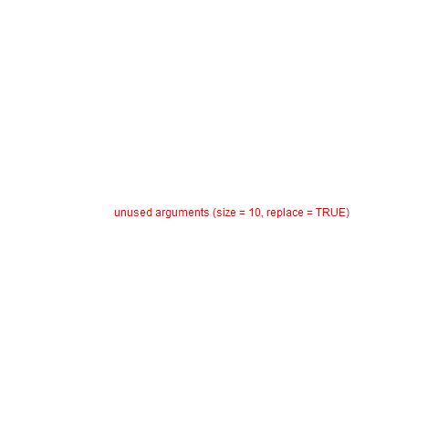

# Table of Contents

-   [Week 2 - August 25](#orge283bd4)
-   [Week 2 - August 27](#org5b0f8bc)
-   [Week 3 - August 30](#orgcb66745)
-   [Week 4 - September 8](#orgdc58093)

# Week 2 - August 25

-   Housekeeping
-   Four approaches to AI
-   Major issues
-   Next week: AI applications

## Housekeeping

-   Protocol ([GitHub](https://github.com/birkenkrahe/ai482/blob/main/2_what_is_ai/protocol_23_aug.md))
-   Bookmarks ([GitHub](https://github.com/birkenkrahe/ai482/blob/main/bookmarks.md))
-   Missing sessions:
    -   Google meet? (Poll: Y/N)
    -   Agendas will be posted

# Week 2 - August 27

-   Housekeeping
-   Rational agents
-   Major issues
    
    *Image: "Grace, the ultra-lifelike nurse robot" ([Cairns, 2021](#org7a8401d))*

## Housekeeping

-   [Google meet](https://meet.google.com/pkv-torj-fyt)
-   Staying on top of AI (blogs)
-   AI presentation = individual
-   AI application = team
-   Make them work in tandem

### [Curated] AI blogs

-   [Top 10 blogs and sites (2021)](https://blog.feedspot.com/ai_blogs/)
-   [10 Best AI Blogs To Follow (2017)](https://blog.education-ecosystem.com/10-artificial-intelligence-blogs/)
-   [Google AI Blog](https://ai.googleblog.com/)
-   [Microsoft AI Blog](https://blogs.microsoft.com/ai/)
-   [Amazon AI Blog](https://aws.amazon.com/blogs/machine-learning/)

## References

 [Cairns, R (19 Aug 2021). Meet Grace, the
ultra-lifelike nurse robot. Online: cnn.com.](https://www.cnn.com/2021/08/19/asia/grace-hanson-robotics-android-nurse-hnk-spc-intl/index.html)

# Week 3 - August 30

-   Housekeeping
-   Mon: AI approaches pros/cons
-   Wed: Ideas generation
-   Fri: Project canvas

## Housekeeping

-   [Google meet](https://meet.google.com/nmy-dydn-kwy)
-   [AI Test 2: What is AI?](https://lyon.schoology.com/assignment/5257337255/assessment_questions)
-   [Followup](https://github.com/birkenkrahe/ai482/blob/main/2_what_is_ai/followup_08_27.md) / [Diary](https://github.com/birkenkrahe/ai482/blob/main/diary.md)
-   [Scrum FAQs](https://github.com/birkenkrahe/org/blob/master/FAQ.md#orge594cc2) / TODO: video (MB)

## Ideas generation

-   Goal: choice of topic
-   Presentation (solo)
-   [Submit presentation ideas (Wed)](https://github.com/birkenkrahe/ai482/discussions/4)
-   AI application (**pick a team!**)
-   Project canvas (Fri)

## AI approaches pros/cons

-   [Group exercise](https://github.com/birkenkrahe/ai482/blob/main/2_what_is_ai/2_what_is_ai.md#pros-and-cons)
-   [Results on Kanban board](https://ideaboardz.com/for/AI%20approaches%20pros%20&amp;%20cons/4063343)
-   [Present and discuss in class](https://github.com/birkenkrahe/ai482/blob/main/3_ai_projects/AI_approaches_pros_cons.pdf)

# Week 4 - September 8

> "I'm concerned with the world in which we'll live tomorrow."

## Housekeeping

-   Test 3: research project
-   Project canvas & sprint review
-   Group work: history of AI

## Project

-   [Project Canvas (sample)](https://github.com/birkenkrahe/ai482/blob/main/3_ai_projects/ProjectCanvasSampleAI.pdf)
-   [First sprint review](https://github.com/birkenkrahe/ai482/tree/main/3_ai_projects/1_sprint_review)

## History of AI

-   ["The Thinking Machine" (1961)](https://youtu.be/5YBIrc-6G-0)
-   Structured group discussion<a id="fnr.1" class="footref" href="#fn.1">1</a>
-   Protocol: Fortunato

## Group discussion

<table border="2" cellspacing="0" cellpadding="6" rules="groups" frame="hsides">

<colgroup>
<col  class="org-left" />
</colgroup>
<tbody>
<tr>
<td class="org-left">A: Can technologists learn anything from historical documents? If yes (or no), why (not)?</td>
</tr>

<tr>
<td class="org-left">B: What's the feeling tone of the film? Optimism, scepticism, ambitions?</td>
</tr>

<tr>
<td class="org-left">C: SWOT analysis (Strenghts/Weaknesses/Opportunities/Threats)</td>
</tr>

<tr>
<td class="org-left">D: What are the key questions/issues here: are they still current?</td>
</tr>
</tbody>
</table>

# Footnotes

<a id="fn.1" href="#fnr.1">1</a> "Structured group discussion" means that I'm providing a
framework for group discussion and group results (e.g. a set of
questions), and a timeline. Your job is to execute the framework
within the allotted time and present the results as good as you
can. For participation, only participating and trying (harder) is
evaluated, not the quality of the result itself.
