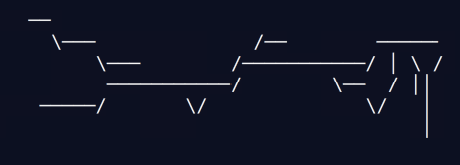
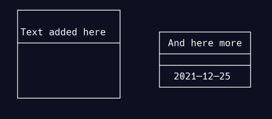
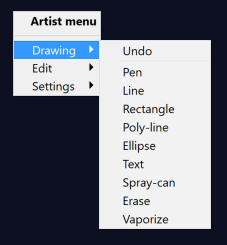
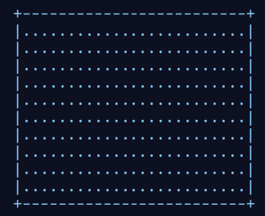
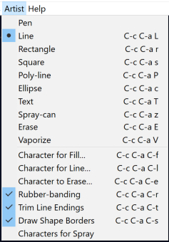
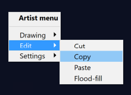
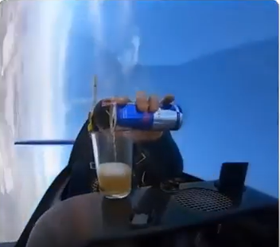

# Table of Contents

1.  [What is this?](#orgf34befb)
2.  [Sunday, 11 July 2021 - GitHub & Cybersecurity](#org81942ed)
3.  [Sunday, 22 August 2021 - End of first week](#org0e4f871)
4.  [Saturday, 28 August 2021 - Games and the Arkansas Experience](#orgfb7155c)
5.  [Sunday, 29 August 2021 - KILT Lyon College Radio](#org489939e)
6.  [Learning is like (physical) exercise (Sept 8)](#org8f4a14e)
7.  [Relevance of agile methodologies (Sept 14)](#org1c8cc3c)
8.  [Florida Man (Oct 5)](#orgde1c63e)
9.  [Transitioning to Windows 10 (Oct 9)](#orgb8152bf)
10. [Linux app under Windows (Oct 22)](#org1f2590b)
11. [Join me in spring 2022! (Nov 3)](#org8027239)
12. [Thanks! (End of fall 2021)](#org8bdb667)
13. [Emacs + ESS + Org-Mode](#orgd85d135)
14. [Creating simple process diagrams in Emacs (1/4)](#orgf57dbc2)
15. [My feeling before the spring term 2022](#orgdda07de)
16. [References](#org8bd9fb5)

# What is this?

A place for irregular articles of possible interest to students
across all courses, mostly to avoid lengthy emails and to park
content that I may want to develop later on time permitting.

# Sunday, 11 July 2021 - GitHub & Cybersecurity

## GitHub

Opted for GitHub as the course platform since I may be arriving too
late to get up to scratch with Lyon's "Schoology" platform. Pro:
opportunity to include Git and GitHub in the course. Con: separate
platform. Another plus - just discovered that Emacs Org-mode renders
as Markdown automatically<a id="fnr.1" class="footref" href="#fn.1">1</a>.

Figured out how to link the GitHub remote repository (`master`) and
the local repo (`origin`) and update the remote repo from the command
line. In the end, however, I resorted to drag-and-drop addition of the
org-file in question ([1\_overview.org](https://github.com/birkenkrahe/dsc101/blob/main/1_overview/1_overview.org)<a id="fnr.2" class="footref" href="#fn.2">2</a>), because I could not update the
file inside the `1_overview` directory remotely. The best (fastest)
solution would be to set up remote services using Emacs' [magit](https://magit.vc/).

Instead of a forum, students can raise `Issues` in GitHub for
discussion. This is just as good as a forum - except that the
infrastructure is not protected and private. But this also helps to
teach the students netiquette and data literacy when being online in a
professional capacity.

## Cybersecurity

Came back from Hamburg yesterday (family good-bye). Interesting
conversation with a taxi driver on the way from the train station: he
does not own a phone and entrusts anything personal only to
handwritten notes. If he wants to share something personal with his
friends or family at a distance, he writes a letter by hand and mails
it via "snail mail" as it used to be called (does it still?). He's
been "radicalized" in a way by media reports and books like this one
by Harvard's Carissa Veliz, "[Privacy is Power: Why and How You Should
Take Back Control of Your Data](https://www.harvard.com/book/privacy_is_power/)"<a id="fnr.3" class="footref" href="#fn.3">3</a>. This made me think, once again,
that it might be neat to focus on cybersecurity and create a course
offering a couple of terms down the line. I recently read this 2020
book on "[Cyber Warfare-Truth, Tactics, and Strategies](https://www.packtpub.com/product/cyber-warfare-truth-tactics-and-strategies/9781839216992)", which is far
out, in some areas. Also interesting: AI and Cybersecurity, which is
an active area of industry (see e.g. [at IBM](https://www.ibm.com/security/artificial-intelligence)), and which I will discuss
in the AI seminar, also in this term.

Next stop: syllabus!

# Sunday, 22 August 2021 - End of first week

I'm pretty satisfied with the first week of classes - managed to get
quite a bit of interesting content into each orientation session -
enough for tests at the start at the 2nd week, and for six follow-up
files. Three syllabi written though the schedules will be changing a
lot - I've only been able to cover 30% of my material in the
available time (story of my life, really).

Students are still a little reluctant to participate - I wouldn't be
any different myself with a brand new instructor. The masks are not
helping, of course. Harder to build rapport for me - I don't know if
my interventions are working, if my jokes are funny, and if my
lectures leave an impression. The eyes as the "windows of the soul"
are definitely overrated in the classroom.

Perhaps this is for the best, because this way I may stop myself
from talking too much, and the masks insulate the students from one
another. Not quite as much as sitting at home during an online
session, but enough to reduce intra-group distractions.

Things I love: the support and the positive feeling all around -
everybody wants to make this term work, everybody delivers or does
their best - under such circumstances, it is easy to give one's
best, too. My office. The heat! Batesville!

I have two new lectures to finish ("What is AI?" and "What is a
model?"), so I must be off, but I'll be seeing you soon. Tonight:
takeaway - first Chinese buffet.

# Saturday, 28 August 2021 - Games and the Arkansas Experience

## Student projects

I survived the 2nd week, too. Despite my reservations about the
masks and all that, rapport is building and classes are getting more
active. Found out that students are not used to writing long essays,
and adjusted my expectations accordingly. That wasn't too hard since
I don't like to read long essays! Next week is all about setting up
the different projects - for an Exploratory Data Analysis project in
DSC 101, for an essay on data modeling for DSC 482.02, and for an AI
application project for DSC 482.01. I'm really looking forward to
seeing what the students come up with. In many ways, data science is
coming to a head - cp. the data vs. modeling debate kicked off by
Andrew Ng, which cuts across the subjects of all three courses.

## Games industry in Arkansas?

I had a nice conversation with an internship student, who turned
out to like similar video games like I - the Dark Souls series, and
other titles. From what she told me, there may be quite a pool of
students at Lyon interested in video games. I'm inspired to think
about ways in which one could use this talent for a gaming industry
startup. This could be fun, and it could potentially be great for
Lyon and for Batesville. There already is a thriving esports
program at the college, and this might fit right in. Also: I need
to get my hands on a PS5!

## Community

On a losely related note: I got my Arkansas drivers license today!
Beginning to feel like a full member of this community. Also: very
impressed with the administrative processes all around. Getting
your license in Germany is a major headache. Weeks later, they send
it to you via surface mail. In Batesville, you present your
documents, do a visual test, and minutes later you walk out, a
freshly printed license and full ID in hand. It's a little like
moving from a Kafka novel into a story where suddenly everything
makes a little more sense.

## How to make the most of your internship

For those interested in an internship, or already working
somewhere - I believe that you might benefit from my internship
course (and you can also pick up 1-2 credits). It involves weekly
meetings of an hour in my office (currently on Fridays at 12 PM). a
brief, informal presentation of your workplace and internship, and
short, weekly blog posts on topics relevant to your internship. The
course prepares you for the transition from college to work. Talk
to me if you want to know more, or come to a Friday meeting. Don't
just go to work and let this opportunity to learn go to waste!

# Sunday, 29 August 2021 - KILT Lyon College Radio

Listened to "[Lamplight](https://lyonradio.weebly.com/programming-schedule.html)", an evening with classical music, by Prof
Oriatti, and had a great time while preparing classes and,
intermittently, exchanging emails with the radio host. I really love
that Lyon has its own radio station. Must come up with some format
(podcast?) on data science. If anyone has an idea, let me know. I've
always wanted to be on the radio. Though a classical music show is
very hard to beat. Oriatti presented a marvelous selection and was
totally responsive to the listeners. He even mentioned data science!

# Learning is like (physical) exercise (Sept 8)

Read this today in an article in WIRED magazine, "How to Ace
Physics Class (Even if You Don't Ace Physics)" ([Allain, 2021](#org5cc7646)):

> "Perhaps the most important thing to remember is that learning can be
> fun, but it can also be hard and confusing. Think of it like exercise:
> The more you sweat, the more you gain. You won't get faster and
> stronger by watching videos of people working out; you actually have
> to do something. And remember, it’s OK to be confused. Confusion is
> just the sweat of learning."

Having studied physics and earned a PhD somehow, this makes sense
to me. The "watching videos won't help" resonates with me, too:
there were none, when I was a student, and it reminds me of Sheldon
Cooper in that Big Bang Theory show where he gets a bloody nose
because he thinks he can ride a bike after watching YouTube videos
about it<a id="fnr.4" class="footref" href="#fn.4">4</a>.

Anyway, I wouldn't overstate the importance of confusion - some
confusion comes from badly written textbooks, badly taught classes,
confused instructors etc. - generally, the more mathematical a
topic and a presentation, the less space there should be for
confusion. There is also "creative confusion", which one
experiences e.g. when stumped by a problem. This is really
important to feel! If you never feel it, you're either a genius or
you're not trying hard enough (you'd know if you're a genius).

# Relevance of agile methodologies (Sept 14)

Students in all of my classes work with agile methodologies. This
week, the first sprint reviews are due. Here is some motivation to
learn this stuff and to do it well:

> "Bloomberg uses the Agile methodology, which has become common in the
> tech industry for application development. The main advantage of the
> Agile methodology is that it creates an interactive communication
> line between the business and engineering teams to iteratively
> deliver value." (Source: [DataCamp, 8/30/2021](#orge08b199))

# Florida Man (Oct 5)

## Gratitude

I'm very grateful for fall break: it's given me my first opportunity
for a vacation in over 2 years. Here's me looking quizzically into
the future (taken in Pensacola, FL, over the weekend<a id="fnr.5" class="footref" href="#fn.5">5</a>):

## Grading

Back home, I'm procrastinating: need to finish grading tests for two
courses, and setting midterm grades for three. I'm like a freshman:
these are my first midterms. In Germany, where I taught before Lyon,
students don't get any information on how they're doing during the
term. Reality often comes crashing down hard on them only at the
very end when it's too late. While I welcome this helpful attitude,
it also makes students a little less independent: if you're not told
how you're doing you have to ask the teacher (which is
uncomfortable), and question yourself honestly. Both of these
actions can help build skills that are useful later. Though many
companies have elaborate feedback structures, official feedback
often comes too late and is watered down as all standardized
procedures are. Here is a quick look at the horror of such a
standard, a "[performance appraisal plan](https://www.dm.usda.gov/employ/employeerelations/docs/Guide-ExPerfPlans.pdf)," if you don't know what I
am talking about. As a manager, I spent a lot of time with similar
tools, and I remain unconvinced of their actual value to the
employee and to the company. *Image: German assessment
center<a id="fnr.6" class="footref" href="#fn.6">6</a>.*

## Ghost of Tsushima

I've come back to this game on the new PS5, and it's fantastic: the
mechanics of this game are so incredibly precise. I used to be a
fencer in my youth, and the swordplay in "Ghost of Tsushima" is so
close to the truth that I find myself remembering moves and parries
from decades ago. Also, playing on "lethal" level (since this is my
2nd playthrough) is almost as challenging as a "Souls" game (like
Demon Souls, Dark Souls or Bloodborne): every single boss encounter
needs to be studied, and it takes me 10 or more attempts to get
anywhere (often more than that). It's wonderfully frustrating but
of course also eats up time, which is why long game play is limited
to the holidays. *Image: one of those boss duels.*

[Check out the trailer](https://youtu.be/A5gVt028Hww).

## Game of life

Not just gaming, but science also continously generates
distractions, because so much interesting stuff is going on,
especially in my areas of interest (data science and machine
learning). Just in time for a session on "literate programming" (in
the data science intro course), and another session on "future of
AI" (in the AI seminar), Lex Fridman has interviewed comp sci hero
Donald Knuth for the second time - you should check out [the podcast](https://lexfridman.com/donald-knuth-2/)
([Fridman, 2021](#org2a6a5ca)) (also available on youtube). It's long (an
excellent distraction), but the length is necessary to really go
deep (this is one of Fridman's specialties, and much needed in this
time of short attention spans and fleeting
attractions)<a id="fnr.7" class="footref" href="#fn.7">7</a>. There's also a [summary](https://thenewstack.io/donald-knuth-on-machine-learning-and-the-meaning-of-life/) of the long interview if
you have little time or patience but a need for soundbites and
essence.

Then conversation between Knuth and Fridman meanders to an
enticing parallel between AI and God:

> “It’s only for me, and — but I but I personally think of my belief
> that God exists, although I have no idea what that means. But I
> believe that there is something beyond human capabilities — and it
> might be some AI, but whatever, but I do believe that there is
> something that goes beyond the realm of human understanding, that I
> can try to learn more about how to resonate with, whatever that
> being would like me to do.” --[Donald Knuth](#org3a11353)

I'm tempted to present this as the opening statement of tomorrow's
session of the AI seminar&#x2026;

*Image: Pensacola beach before the monsoon, October 4, 2021.*

# Transitioning to Windows 10 (Oct 9)

The 2019 Dell Latitude laptop (running Ubuntu Linux 18.04 LTS) that
I had brought from Germany, whose keyboard always reminded me of
home, went on the fritz with some unrecoverable RAM error. I'm not
too impressed with the lifetime, but then again, I put the little
guy through a stress test. It may be that the RAM came lose - I'd
have to open it to make sure, which I may do.

However, this was also a great opportunity to finally move to my
Lyon 2021 Dell Precision laptop - a heavy computing beast. At first,
I had wanted to dump Windows for Linux but then some of your
comments rang in my ears from past courses, and I experienced
students' difficulties of Windows + R myself: it seemed appropriate
to share their development burden and get off my high Linux
horse<a id="fnr.8" class="footref" href="#fn.8">8</a>. Also, here was an opportunity to try Emacs + ESS +
Org-Mode + R as a bundle and perhaps bring some students with me to
the bright side!

I also work with GitHub Desktop now - this is an app, not the
command line (hence it has a lot less flexibility, like all graphic
environments), but it's Okay for my limited use of GitHub (namely,
developing scripts and text files and sharing them in the cloud -
something that I could achieve with GDrive). The reason why we use
GitHub is (a) to get to know it (most prominent development
environment), and (b) because it's much easier to follow/suggest
changes in my source code via forks and issues. Some students seem
to have forked my repos, but so far nobody has submitted an issue.

The installation of [Emacs + ESS + R as a scientific stats IDE](https://github.com/birkenkrahe/org/blob/master/FAQ.md#org6e00b83)<a id="fnr.9" class="footref" href="#fn.9">9</a>, and
the installation and [use of GitHub Desktop](https://github.com/birkenkrahe/org/blob/master/FAQ.md#orgf34e53d) are subject of two new
FAQs. Let me know how you get on with these - in the data science
course (where I also work with Google Colaboratory), we may take
some time to go through these instructions<a id="fnr.10" class="footref" href="#fn.10">10</a>

# Linux app under Windows (Oct 22)

Thanks to our IT services member (and CompSci student) Brittany,
I've now got Linux running under Windows 10 as an app from the
Microsoft store. This is pretty neat and fast, and beats PowerShell,
because now I have easy access to `bash` (command line shell), `gcc`
(C/C++ compiler), and even Emacs (though `-nw`, that is without
X-Windows, but that's fine, I prefer the downgraded version that
forces you to know the keystrokes instead of having to move back and
forth between keyboard and mouse). The path to getting this app to
run is, alas, not for the faint-hearted. Brittany sketched it for
me - try this on your machine<a id="fnr.11" class="footref" href="#fn.11">11</a>!

## Download Linux

Type `Microsoft store` in the search bar (next to the task bar),
and then search for `Ubuntu` in the search field inside the
store. You find different distributions. Pick `Ubuntu 20.04
   LTS`<a id="fnr.12" class="footref" href="#fn.12">12</a> and click on `Get` to download the installer. The
distribution will take about 0.5 GB disk space.

*Image: info about the distribution from Canonical*

When I tried to launch this app, I got an error due to Windows
security settings, since you're messing with the system level here
(so this does make sense).

## Turn Developer Mode On

Go to the Windows search bar and look for `Windows Security
   Settings`. The following page will open.

*Image: Windows Security settings*

Find the developers menu point on the left hand side and open the
menu. In this menu, `Developer Mode` needs to be turned `On` as
shown in the image below.

*Image: Windows Security Settings for Developers*

## Enable Windows subsystem for Linux

Go to the Windows search bar and look for `Turn Windows features on
   or off`. A screen pops up. Scroll down until you see `Windows
   Subsystem for Linux`. This allows Linux to take a portion of the
system disk for itself (I think). Check this option as shown below.

*Image: Enable Windows Subsystem for Linux*

When saving this menu with `OK`, you'll be prompted to restart the
computer. After you did this, you should be able to boot Linux
using the app.

# Join me in spring 2022! (Nov 3)

I've got around to writing down some of the things I'd like to do in
my spring 2022 courses. Knowing that y'all wanting to pick your
courses, I'm going to pin [these notes](https://github.com/birkenkrahe/org/blob/master/spring22.md) to the board outside my office
(or you can [print this PDF](https://github.com/birkenkrahe/org/blob/master/spring22.pdf) and distribute it among your friends and
family :-).

Reading through the list of planned topics, I already know that I
won't be able to cover everything listed here, but an instructor can
have dreams, right?

If I were you, I'd have difficulty deciding which course to take! As
someone interested specifically in **data science**, I think both DSC
205 (machine learning) and CSC 330 (databases and SQL) are
important.

The other two - C/C++ and Operating Systems - are perhaps more
relevant for computer science students, or for anyone interested in
gaining greater control over computers (which you should all want to
do!). These are also courses about computational literacy, since
system programming (which is what these courses are about) is
constantly changing - and the number of people who know anything
about it is dwindling - so these are highly marketable skills.

No matter what you may think: you can handle the algorithms!

---

> “The Linux philosophy is ‘laugh in the face of danger.’ Oops. Wrong
> one. ‘Do it yourself.’ That's the one.” — [Linus Torvalds](https://en.wikipedia.org/wiki/Linus_Torvalds), creator of
> Linux

# Thanks! (End of fall 2021)

I've recorded a short [good-bye video](https://youtu.be/IxyqEW9-12s) and distributed detailed end of
course notes for each of my three classes, my first term at
Lyon. Looking forward to spring 2022!

# Emacs + ESS + Org-Mode

There's a new kid in town - at least as far as Lyon CS is concerned:
Emacs + ESS + Org-mode. There are various FAQs (that nobody ever
asked, actually) on Emacs, and the whole topic will heat up now that
I haved decided to introduce Emacs + ESS + Org-mode for literate
source code programming (LitProg) and data science (DS) in all my
classes.

There is a deeper reason for Emacs and LitProg: CS people (everybody
really) has to deal with information systems that get more and more
complicated and conceptually difficult. Abstraction is the name of
the game everywhere. CS and DS are system sciences (or crafts), and
they deserve the best paradigm when it comes to system control and
management, and Emacs is the answer to that.

Here is a particularly interesting [recent post](https://www.admiralbumblebee.com/programming/2020/01/04/Six-months-VS-Code.html) by AdmiralBumbleBee
(2020) contrasting VS Code and Emacs, concluding that Emacs is a
superior environment when it comes to:

-   Windows management (with `ace-windows`)
-   File management (with `Dired`)
-   Coding (especially literate coding with `Org-mode`)
-   Extending functionality (`Elisp` packages)

Especially for students (rather than developers with their
state-of-the-art computers), Emacs is good because it's easy on the
memory and the processing even if your laptop is not from 2022.

I also enjoyed [Timachi's post (2019)](https://hadi.timachi.com/2019/12/07/Why_I_switched_from_VScode_to_Emacs), who switched to VS Code and
back. Regarding Emacs' famous "steep learning curve" (which I cannot
confirm - I remember learning Emacs for the first time ages ago, and
re-learning it a couple of years ago):

> "Emacs can be a challenge if you are used to using mouse
> pointer. One should be willing to leave the mouse and stick with the
> keyboard."

He gushes over Org-mode, too - a main reason for our using Emacs
this term:

> "Org mode is for sure one of the most amazing pieces of software I
> have ever seen or worked with. It does things that no other text-based
> word processor can do, even if you are writing complex scientific
> reports. VS code has an extension which brings less than 5% of Org
> mode functionality, tops and that is mostly the code highlighting."

# Creating simple process diagrams in Emacs (1/4)

I needed diagrams because I wanted to make a simple
diagram. Usually, I would have drawn this in Signavio, or in
PowerPoint, made a screenshot, saved it and embedded it in the
Org-file using Emacs. 4 steps, 4 softwares, and not much to show for
it.

Since I like to do everything in Emacs using the keyboard, I was
curious if this can be done using ASCII, without extra tools. I
found two ways (in fact, there is a third one, Emacs `artist` mode
(built into Emacs) and `ditaa` (which is no longer distributed with
Org).

1.  [Poor man's UML / Emacs Artist Mode](https://robrohan.com/2015/01/17/poor-mans-uml-artist-mode.html) (Rohan, 2015)
2.  [Drawing with `picture-mode`](https://flylib.com/books/en/2.27.1.72/1/)
3.  [Generating simple process diagrams using dot and tables](https://orgmode.org/worg/org-tutorials/org-dot-diagrams.html)
4.  [PlantUML and Emacs](https://plantuml.com/emacs) - wrapper to [GraphViz](http://www.graphviz.org/)

For today, I'll only try artist mode, but I'm especially
interested in `PlantUML`, because I want to teach the students to
create simple UML diagrams before coding.

\*Note that these diagrams do not render properly on GitHub (either
as Org or Markdown files), or as HTML in a browser. Best look at it
in Emacs. For this post, I have inserted screenshots.

## `ascii-art-to-unicode`

When I looked for `artist-mode` in the `*Packages*` list, I found
that it was built-in, but I found another neat addition in the
package list, [`ascii-art-to-unicode`](https://elpa.gnu.org/packages/ascii-art-to-unicode.html). This package polishes simple
line drawings and makes them look much better. Installed
it. Here is an example:

<table border="2" cellspacing="0" cellpadding="6" rules="groups" frame="hsides">

<colgroup>
<col  class="org-left" />

<col  class="org-left" />
</colgroup>
<thead>
<tr>
<th scope="col" class="org-left">Key sequence</th>
<th scope="col" class="org-left">Action or function</th>
</tr>
</thead>

<tbody>
<tr>
<td class="org-left">M-x artist-mode RET</td>
<td class="org-left">Invoke artist mode</td>
</tr>

<tr>
<td class="org-left">C-c C-a r</td>
<td class="org-left"><code>artist-select-op-rectangle</code></td>
</tr>
</tbody>
</table>

<table border="2" cellspacing="0" cellpadding="6" rules="groups" frame="hsides">

<colgroup>
<col  class="org-left" />

<col  class="org-left" />
</colgroup>
<thead>
<tr>
<th scope="col" class="org-left">Key sequence</th>
<th scope="col" class="org-left">Action or function</th>
</tr>
</thead>

<tbody>
<tr>
<td class="org-left">C-c C-c</td>
<td class="org-left"><code>artist-mode-off</code></td>
</tr>

<tr>
<td class="org-left">C-x n n</td>
<td class="org-left"><code>narrow-to-region</code></td>
</tr>

<tr>
<td class="org-left">untabify region</td>
<td class="org-left"><code>untabify</code></td>
</tr>

<tr>
<td class="org-left">M-x aa2u RET</td>
<td class="org-left">Apply aa2u</td>
</tr>
</tbody>
</table>

Check the [vignette for aa2u](https://elpa.gnu.org/packages/ascii-art-to-unicode.html) for more details.

## Emacs `artist-mode`

> "Most people that see me using it either think it’s the most
> ridiculous thing they’ve seen, or they think it’s the coolest thing
> since sliced bread." (Rob Rohan, 2015)

I side with those who think it's cool. Tried this first a couple of
years back when I returned to Emacs but haven't used it since.

There is a [video demo](https://youtu.be/cIuX87Xo8Fc) (13 min) at the end Rohan's blog post. Here,
I'm going to retrace the demo and aim at creating my own simple
diagram at the end. I won't bother with PNG files via `ditaa` for
now.

To make the ASCII art into image files, Rohan suggests [`ditaa`](http://ditaa.sourceforge.net/),
which apparently was bundled with Org in the past, but is no longer
bundled with it.

`artist` mode is built in. From the vignette<a id="fnr.13" class="footref" href="#fn.13">13</a>:

> "Artist is an Emacs lisp package that allows you to draw lines,
> rectangles, squares, poly-lines, ellipses and circles by using your
> mouse and/or keyboard. The shapes are made up with the ascii
> characters |, -, / and \\."  ([Source: EmacsWiki](https://www.emacswiki.org/emacs/ArtistMode))

### Drawing a poly-line

This is the example from the vignette:

    M-x artist-mode RET
    C-c C-a p RET
    RET

To create it, I just moved around the screen with my cursor, and
Emacs created a line drawing from it. You should try it!

### Rectangles

    M-x artist-mode
    C-c C-a r
    <draw rectangles>

Here are a few examples<a id="fnr.14" class="footref" href="#fn.14">14</a>:

### Add text

    M-x artist-mode
    C-c C-a t
    <enter text>

### Flood fill

The following sequence created the filled rectangle below. You can
call upon all `artist-mode` commands with the mouse
`<middle-button>`:

    M-x artist-mode
    C-c C-a r
    <draw rectangle>
    <middle-button>
    <flood fill>

### Other commands

The image shows the `artist-mode` menu.

Especially when you have a tablet, drawing with "pen" is
cool. Artist mode is for friends of the mouse or pen. Keyboard
afficionados may prefer `picture-mode`.

Important: when drawing in an Org-mode file, use `C-x n n`
(`narrow-to-region`), to draw without disturbance. The presence of
headlines gets `artist-mode` confused at times. Return to the
buffer with `C-x n w` (`widen`).

Cool: you can copy/cut/paste figures to the clipboard by drawing a
rectangle around it.

### Rendering ASCII art as graphics

[`ditaa`](https://orgmode.org/worg/org-contrib/babel/languages/ob-doc-ditaa.html) will convert ASCII diagrams into bitmap graphics. `ditaa`
is a Java library that is executed on the command line after being
loaded into Emacs as a Babel file. The second part of [Rohan's
video demo](https://youtu.be/cIuX87Xo8Fc) shows examples.

Can't wait to try this with students in class!

# My feeling before the spring term 2022

[My feeling before the spring term 2022.](https://drive.google.com/file/d/1PMvBQlHSvB-gmQ4hvuvfkFg4YUxOee6m/view?usp=sharing) (30 sec video)

(Source: [Twitter](https://twitter.com/zone_astronomy/status/1474930694698815488?s=20).)

Also: I'm enjoying [2021's breakthroughs in maths and computer
science](https://www.quantamagazine.org/the-year-in-math-and-computer-science-20211223/) (Quantamagazine, 2021) while preparing classes.

# References

AdmiralBumbleBee (Jan 4, 2020). What I learned from 6 months with VS
Code [blog]. [URL: admiralbumblebee.com](https://www.admiralbumblebee.com/programming/2020/01/04/Six-months-VS-Code.html).

 D'Introno (2021). Event Recap: Bridging the
Communications Gap with Data Literacy. [Online: datacamp.com](https://www.datacamp.com/community/blog/event-recap-bridging-the-communications-gap-with-data-literacy).

 Fridman L (Sept 9, 2021). Donald Knuth: Programming,
Algorithms, Hard Problems & the Game of Life | Lex Fridman Podcast
\#219 [Podcast]. [Online: lexfridman.com](https://lexfridman.com/donald-knuth-2/).

 Cassel D (3 Oct 2021). Donald Knuth on Machine Learning
and the Meaning of Life [Blog]. [Online: thenewstack.io](https://thenewstack.io/donald-knuth-on-machine-learning-and-the-meaning-of-life/).

Rohan (Jan 17, 2015). Poor mans UML / Emacs Artist Mode [blog]. [URL:
robrohan.com](https://robrohan.com/2015/01/17/poor-mans-uml-artist-mode.html).

Timachi (Dec 7, 2019). Why I switched from VScode to Emacs
[blog]. [URL: hadi.timachi.com](https://hadi.timachi.com/2019/12/07/Why_I_switched_from_VScode_to_Emacs).

United States Department of Agriculture (n.d.). Performance
Appraisal Plan Examples. [Online: dm.usda.gov.](https://www.dm.usda.gov/employ/employeerelations/docs/Guide-ExPerfPlans.pdf)

 Allain R (20 Aug 2021). How to Ace Physics Class (Even if
You Don’t Ace Physics) [Blog]. [Online: wired.com](https://www.wired.com/story/how-to-ace-physics-class-even-if-you-dont-ace-physics/).

# Footnotes

<a id="fn.1" href="#fnr.1">1</a> Though the wiki pages cannot be added, they have to be exported
into Markdown, which is a bit of work. Note to self: automate workflow!

<a id="fn.2" href="#fnr.2">2</a> Org-mode insight: to switch off automatic replacement of
sub/superscripts, add the line `#+OPTIONS: ^:nil` at startup.

<a id="fn.3" href="#fnr.3">3</a> An excerpt from this book might become an assignment for this
course and/or for the AI seminar.

<a id="fn.4" href="#fnr.4">4</a> That (early) trust in the Internet is both endearing and
endangering. Endangering, because our brains don't have a switch or a
safety valve that reacts to fake Internet content, we are its
victims. Endearing, because so many people (I wanted to know how many
but I couldn't find reliable statistics - data science project!?)
upload helpful information for complete strangers.

<a id="fn.5" href="#fnr.5">5</a> This is a 10-hour drive from Batesville, AR. In Germany, 10
hours get you from Flensburg in the North (on the Danish border) to
Garmisch-Partenkirchen in the Alps (on the border to Austria). That's
as far as you can go in Germany, and in the Southlands, it gets you to
the nearest beach. The route goes through 5 different states, which is
great fun for a recent immigrant. Linda the friendly, boring Google
maps bot, announces each state, "Welcome in Alabama" etc.). You'd
think that I'd be knackered after driving for 20 hours but actually, I
am not, quite the opposite, I'm rather energized by the experience!

<a id="fn.6" href="#fnr.6">6</a> An assessment center is an event where many applicants are
simultaneously assessed for their suitability. It usually lasts longer
(one day or more) and involves solo and team exercises, interviews,
etc. The whole thing is often observed by senior members of the
company or organization. Naturally, all challenges are standardized.

<a id="fn.7" href="#fnr.7">7</a> Fridman is a Russian machine learning expert from MIT, and if
you know Russians then you know that they tend to extremes (ever read
Tolstoy? Dostoyevsky?). I love this though I can only take so much of
it - I like that fact that it's different from what everyone does, and
I like the result that Fridman gets with his method. You should check
out some of his other podcasts, e.g. with Elon Musk.

<a id="fn.8" href="#fnr.8">8</a> If you want both Linux and Windows 10, you can either install
Linux in a VirtualBox (open source software owned by Oracle), or run a
dual boot system. But I already know Linux well, and my interest is to
have the most productive, most efficient work environment - so if I
cannot have Linux for that, then at least I can get the inside track
of students' (and many other peoples') pains with Windows. Though as I
am writing this, I am struggling with my feelings: it seems really
hard to get LaTeX for Windows, which means it's hard to generate PDFs
(except by generating HTML code and then printing it as PDF). There
are many reasons, why [Linux is better than Windows](https://www.lifewire.com/windows-vs-linux-mint-2200609).

<a id="fn.9" href="#fnr.9">9</a> In fact the Emacs distribution I found has a bunch of fantastic
software on board, including AUCTeX (a version of the typesetting
system TeX), and secure network communications that allow to use Emacs
as a news or email client, too (though this is not something I do).

<a id="fn.10" href="#fnr.10">10</a> As part of the session on literate programming and (later)
package and code development in R. Of course, there is also always
RStudio, but that's a commercial solution (freemium model)
increasingly wed to the "tidyverse", which I find increasingly
unsuitable (see the update of Matloff's "TidyverseSceptic" essay.

<a id="fn.11" href="#fnr.11">11</a> If you attend my "operating systems" or "C/C++ programming"
courses, you'll have to do this anyway, since there's no way around
Linux in my classes - I just love it too much, and you must learn it.

<a id="fn.12" href="#fnr.12">12</a> This is the most recent Long Term Support (LTS - supported
until 2025) version of Ubuntu Linux, a popular, well supported
distribution. I mainly picked it also because I've worked with Ubuntu
18.04 LTS before.

<a id="fn.13" href="#fnr.13">13</a> A vignette is a manual page for a software package.

<a id="fn.14" href="#fnr.14">14</a> I'll always smoothen my diagrams with with
`ascii-art-to-unicode` adjunct to `artist-mode` as explained in this
post earlier, and I won't especially mention this.
