# Table of Contents

1.  [README](#org64760a6)
2.  [Buffer and key basics](#org7a18260)
3.  [The mode line - basic buffer movement](#org62b7f12)
4.  [Indentation, lines, paragraphs, undo](#orge5b3d2e)
5.  [Splitting windows](#orgbf4c282)
6.  [Delete, copy, kill/cut, yank/paste text](#orgc2a8ddf)
7.  [Searching up and down](#orgee36392)
8.  [Directory and listing buffer](#orga324629)
9.  [Open shell, write, export, time stamp file](#orgc6c50a3)
10. [Getting help](#orgd65ceb8)
11. [Looking up online help](#org37097dc)
12. [More information: video, refcard, FAQs](#orge852341)
13. [Glossary / Emacs cheat sheet](#org12f27a8)
14. [Acknowledgements](#orgaf613b1)

")

Image source: <https://xkcd.com/378/>

# README

-   This is a makeshift Emacs tutorial for absolute beginners to enable
    you to do the most basic things with Emacs as your text editor.

-   For the best gain from this tutorial, open Emacs on the terminal
    (command line interface) with `emacs -nw -q` in non-graphics mode,
    without loading a customization file (like `.emacs` or `init.el`).

-   You should be able to complete this tutorial in less than 1 hr -
    likely less than half the time of the more comprehensive Emacs
    onboard tutorial (reachable e.g. from the startup screen).

-   Unlike the standard tutorial, this is an instruction file: you will
    do the editing in a separate text file whose content you will
    download.

-   Here are links to the videos ( 2 x 30 min) in which I go through the
    tutorial step by step: [Part 1](https://youtu.be/RdRbm1wG1Gc) and [Part 2](https://youtu.be/VhsEMIjAaEk).

# Buffer and key basics

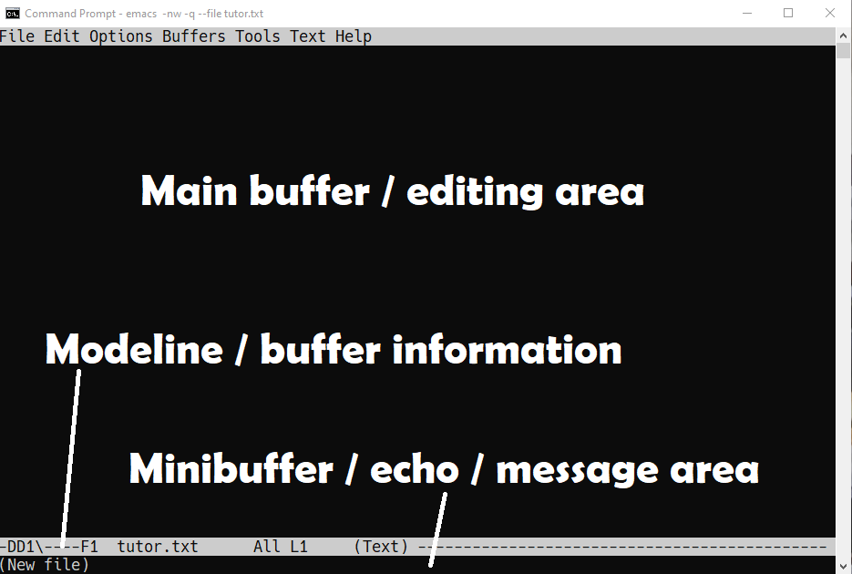

-   An Emacs **buffer** has three parts:
    -   The main **editing** area at the top (to edit text)
    -   The **mode line** below it (file and buffer information)
    -   The **minibuffer** at the bottom (for messages and input)

-   Most commands are bound to keys beginning with `C-` (CTRL), or `M-` (for
    "Meta", which is the `<ALT>` key on most keyboards).

-   For example, `C-x C-f` means: hold down CTRL and press x and f. `M-<`
    means: hold down `ALT` + `SHIFT` + `<` all at the same time.

-   Most commands are shown in the minibuffer (or *echo* area) so when you
    have compound commands like `C-x C-f`, you can check your progress.

# The mode line - basic buffer movement

1.  Open a new file with `C-x C-f`. At the prompt, enter the file name:
    `tutor.txt` and press `<RET>`.

2.  Alternatively, you can also open the file directly from
    the command line: `emacs --file tutor.txt -nw -q`.

3.  The modeline shows (among other things):
    -   A few dashes to indicate the edit status (`----`)
    -   A file name (`tutor.txt`)
    -   How far down in the file you've come (`All` because it's empty)
    -   The line number your cursor is on (e.g. `L1`)
    -   The file mode (`Text`)

4.  Open a browser, open at [tinyurl.com/text-txt](https://tinyurl.com/text-txt) and save the file
    (with a mouse right-click) as `text.txt` in your downloads
    directory - `c:/User/yourname/Downloads`.

5.  In `tutor.txt`, enter `C-x i` and insert the file `text.txt` from its
    location, `Downloads`. If you mess up (at any time), type `C-g` to
    quit any command sequence:
    
    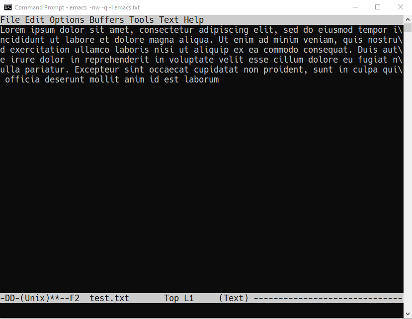

6.  The mode line now indicates that the file has been changed: `**--`

7.  Save the file with `C-x C-s`. You should get a confirmation in the
    minibuffer, alongside the full path to the file - and the mode line
    changes to `----`:
    
        Wrote c:/Users/birkenkrahe/tutor.txt

8.  The text is saved as one long line. Go to the start of the line
    with `C-a`, then to the end with `C-e`.

9.  Go back on the line with `C-b`, and forward with `C-f` (one character),
    or with `M-b` and `M-f` (one word).

10. Type `M-x column <TAB> <RET>` (that's `ALT` + `column` + `Tab-key` +
    `Enter`). The command completes to `M-x column-number-mode`. In the
    mode line, you will now see both row and column number of the
    cursor position.

11. This last command "toggles", which means that you can switch it
    on/off by repeating the command. Try that a couple of times.

# Indentation, lines, paragraphs, undo

1.  To distribute the text over more than one line, enter `M-q`, or `M-x
       fill-paragraph`: this command will fill the text in lines of max 70
    characters).

2.  You can also toggle `M-x auto-fill-mode`, which will fill the
    paragraph any time you're at the of a line. You're told when a mode
    is enabled/disabled for the current buffer.

3.  Test that: go to the end of the current paragraph, enter a new
    (empty) line and insert the text from `text.txt` once again (`C-x i`).

4.  Enable `auto-fill-mode`, go to the end of the new line you just
    inserted, and press `<RET>`. The paragraph should be filled just so.

5.  You probably want to see this again! Type `C-x u` (or `C-/` or `C-_`) to
    undo the last operation, then press `<RET>` again. The minibuffer
    will report `Undo`.

6.  `C-x` commands can be repeated as often as you wish. For example, to
    go back 4 words, enter `C-u 4 M-b`.

7.  If you filled the lines, you should now have multiple lines. To go
    up and down them, use `C-p` (up/previous) and `C-n` (down/next). How
    would you go up 3 lines?  Right: `C-u 3 C-p`.

8.  Add the `text.txt` files another 5 times: navigate to the end of
    the text using `C-e` (end of line) and `C-n` (next line). Then 5 times:
    -   `<RET>` to create a new line
    -   `C-x i text.txt <RET>` to insert
    -   `C-e` to go to the end of the line
    -   Press `<RET>` to auto-fill paragraph

9.  To scroll one page down in this large file, use `C-v`. To scroll up,
    use `M-v`.

10. To go to the top of the file, enter `M-<`. To go to the end of the
    file, enter `M->`.

11. To recenter so that the line under the cursor is in the middle of
    the window, enter `C-l`.

12. Move around the file a little **without touching your mouse**:
    -   Jump to the top of the buffer (`M-<`)
    -   Go down one page (`C-v`)
    -   Go to column 35 jumping by words (`M-f`)
    -   Correct with character movements until you're at 35 (`C-f`, `C-b`)
    -   Jump to the end of the file (`M->`)
    -   Go up two pages (`M-v M-v`)
    -   Recenter (`C-l`)
    -   Go to the end of the line (`C-e`)
    -   Go back to the top of the buffer (`M-<`)

# Splitting windows

You can split windows any way you like.

1.  Split the window horizontally with `C-x 2`.

2.  Split the window you're in vertically with `C-x 3`.

3.  Move between windows with `C-x o` <a id="fnr.1" class="footref" href="#fn.1" role="doc-backlink">1</a>.

4.  Delete a window you're in with `C-x 0`

5.  Delete all but the current window with `C-x 1`.

6.  Recreate the following window setup:
    
    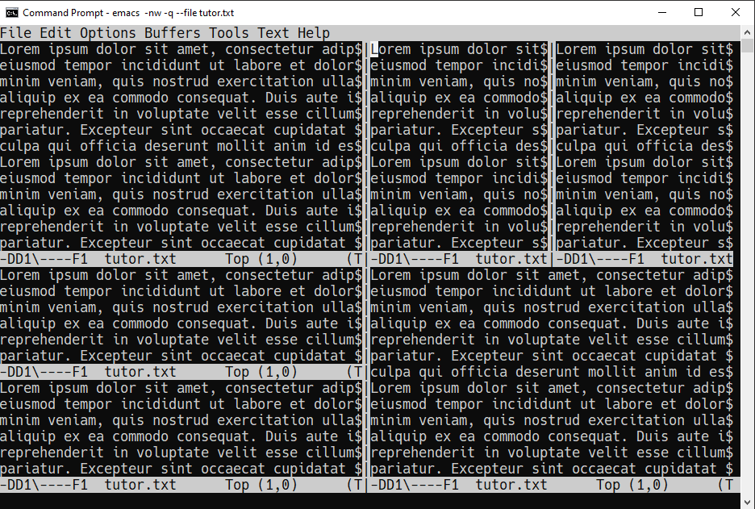

7.  Delete all but the current window with `C-x 1`.

# Delete, copy, kill/cut, yank/paste text

1.  You can delete the character under the cursor with `C-d`. Go ahead
    and delete some characters anywhere in the text.

2.  You can delete forward by toggling `M-x overwrite-mode`. Try that:
    press the space bar (`<SPC>`) a few times with and without overwrite
    mode. The modeline now shows `Ovwr`.

3.  Disable overwrite by running the function again: `M-x
       overwrite-mode`. There should now be **no** `Ovwr` in the mode line.

4.  Highlight a region: mark the beginning of the region with `C-SPC`
    (minibuffer: `Mark set`), and then move the cursor to wherever you
    want to end it:
    
    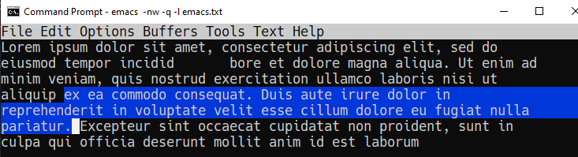
5.  You can now run commands on the region, for example:
    -   delete it (`<Backdelete>`)
    -   cut ("kill") it (`C-w`)
    -   copy it (`M-w`)
    -   paste ("yank") it (`C-y`)

6.  To try this, mark a whole paragraph (beginning with `Lorem` and
    ending with `laborum`) and cut it (`C-w`).

7.  Move to the end of the buffer (`M->`), enter a new line (`<RET>`) and
    yank the region there (`C-y`).

8.  Mark another paragraph and copy (`M-w`) it, then go to to the top of
    the buffer (`M-<`) and yank it (`C-y`).

9.  If you prefer to use the Windows key bindings (cut = `C-x`, copy =
    `C-c` and paste = `C-v`) you can toggle them with `M-x cua-mode`.

10. However, `cua-mode` bindings will only be active when the mark is
    active, that is when a mark has been set or a region selected.

# Searching up and down

1.  Emacs supports "incremental" search: start it with `C-s` followed by
    the search term:
    
    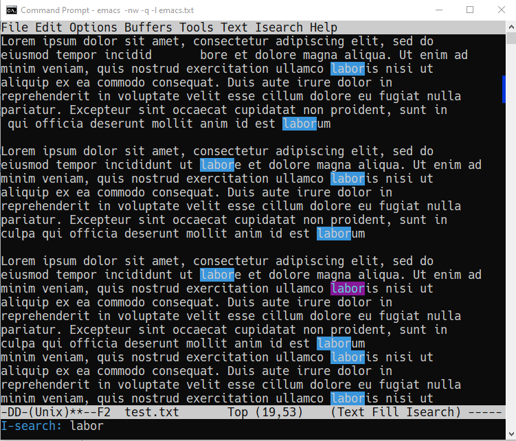

2.  Search for `l`, and then add `o` for `lo`, `<backdelete>` (←) and change it
    to `lu`, then `<backdelete>` again and change it to `labor`. Repeat `C-s`
    to move through the found instances.

3.  To end the search and get back where you started: `C-g` (quit). To
    stay where you found an instance: `C-f`.

4.  Search for `labor` again and keep going until the search wraps around
    the end of the buffer and goes back to the top.

5.  Search backwards in the same manner with `C-r`. The minibuffer will
    tell you what kind of search you've got going, e.g. `Overwrapped
       I-search backward` when you incrementally searched past the buffer
    with `C-r`.

6.  Stop the search (`C-g`) and start it again: if you do not enter a
    search term but just type `C-s` or `C-r` again, the last search term
    will appear.

7.  Stop the search with `C-g`.

# Directory and listing buffer

1.  Remove all windows but one with `C-x 1`.

2.  List the current directory with `C-x d` - this opens a new `Dired`
    ("Directory editor") buffer, which is very powerful.

3.  `Dired` has a bunch of single letter commands. One is `s` to sort the
    files by *name* or by *time* (shown in mode line): Go to the top of the
    buffer (`M-<`), then toggle this by pressing `s` twice.

4.  In the directory list, `.` stands for the current directory (the name
    of which appears at the top), and `..` stands for the next upper
    level directory.

5.  Go to the `..` line and press `<RET>` - this will get you to the
    directory above your own. Find `Downloads`, go to that line with the
    cursor and press `<RET>` to get back to where you came from.

6.  When the cursor is on the line for that file or directory, you can:
    -   rename it with `R`
    -   copy it with `C` (upper case)
    -   compress it (zip it) with `c` (lower case)
    -   mark it for some other command with `m`

7.  Split the screen horizontally, and in one of the two screens show
    the directory one level up:
    
    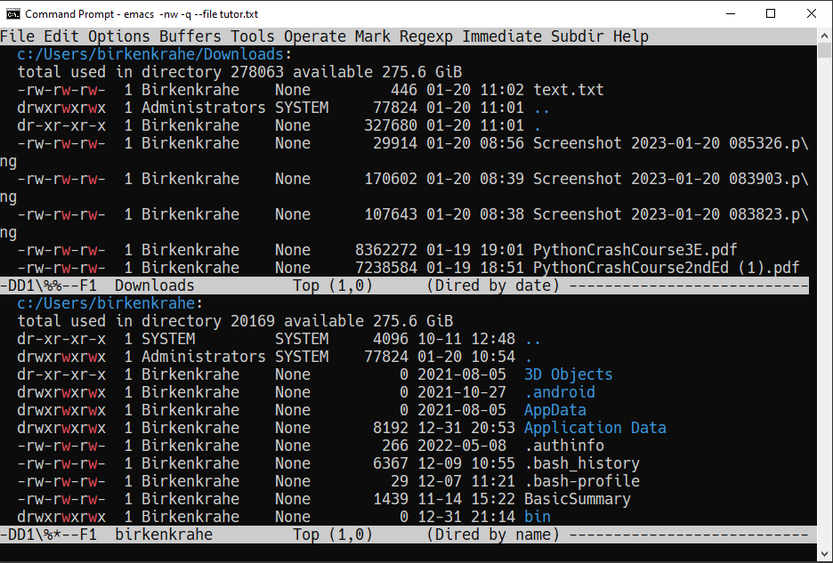

8.  In the `Downloads` directory, find `text.txt` and copy it to the other
    directory:
    -   Go with the cursor to the file `text.txt` and type (upper case) `C`
    -   In the minibuffer, delete `Downloads/` , then `<RET>`
    -   The copy of the file appears in the other buffer

9.  Now, you already have several buffers open, including the file
    `tutor.txt`, a `Dired` buffer, and others: display all open buffers in a
    separate window with `C-x C-b`.
    
    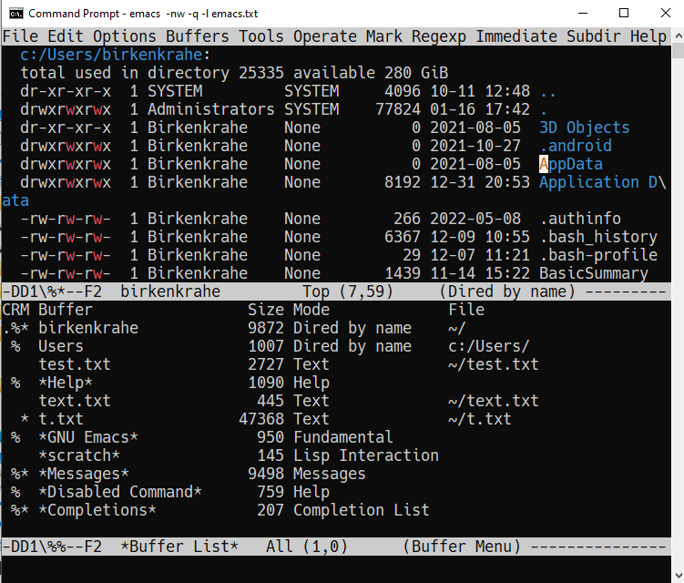

10. Change to the `*Buffer List*` window with `C-x o`. Move the cursor on
    the line with `*scratch*` and press `<RET>` to open the `*scratch*`
    buffer.

11. Now enter `C-x b` and you see the message `Switch to buffer (default
        *Buffer List*):` in the mini-buffer. If you press `<RET>`, you get back
    to the `*Buffer List*`.

12. Enter `C-x b` again, but this time type `M-p` when the cursor is in the
    mini-buffer: the buffer you were in before that (the `Dired` buffer)
    is suggested. With `M-p` you can get to previous, with `M-n` to the
    next default until the list is at an end.

13. Using `C-x b`, return to the `tutor.txt` buffer and delete all other
    windows with `C-x 1`.

# Open shell, write, export, time stamp file

To close, there are a few special environments worth noting - you'll
be using them plenty later on:

1.  `M-x eshell` opens a Linux-style shell. In the shell, at the prompt
    `$`, enter `pwd` - the answer should be the location of your `tutor.txt`
    file. You can also compile files in this shell.

2.  Return to `tutor.txt`. Write the file to an Org-mode file `tutor.org`
    with `C-x C-w`: at the prompt in the minibuffer enter this name. The
    mode line will now list `tutor.org` and the mode `(Org)` instead of
    `tutor.txt` and the mode `(Text)`.
    
    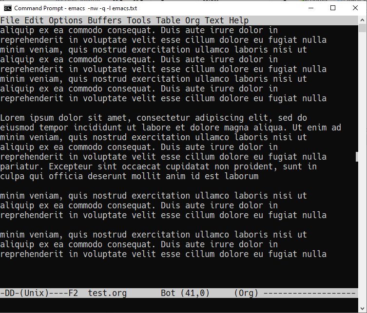

3.  Go to the top of the file (`M-<`), create an empty line and write
    into it: `* Headline` - the space between `*` and the text is
    important!

4.  Org-files can be exported in a variety of file formats: `HTML`,
    `LaTeX`, `ODT`, `text` and more. Enter `C-c C-e` to open the Org-file
    export dispatcher. When the prompt `Export command:` in the
    mini-buffer appears, enter `h o` - the text will be opened as an HTML
    file in your default browser:
    
    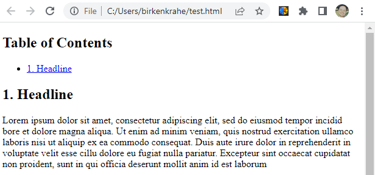

5.  Go back to `tutor.org` in Emacs. Remove all content from the file and
    save the empty file:
    -   Mark whole buffer with `C-x h`
    -   Delete with the `<backdelete>` key (←)
    -   Save file with `C-x C-s`

6.  Insert these lines at the top of the buffer:
    
        #+TITLE: Emacs Tutorial
        #+AUTHOR: YourName [PLEDGED]
        Time-stamp: <>

7.  Recall that **"Pledged"** means that you have actually completed the
    tutorial along the lines of the instructions and in good faith as
    laid out in the [Lyon College Honor Pledge](https://catalog.lyon.edu/the-lyon-college-honor-pledge).

8.  Insert a time stamp with the command `M-x time-stamp`:
    
    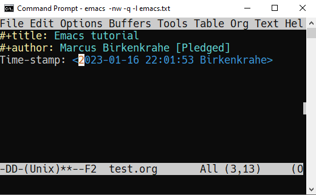

9.  Save the file with `C-x C-s` and submit it in Canvas.

# Getting help

1.  For the full tutorial experience, open the Emacs tutorial (link on
    start page, or `C-h t`). In class, we're going to start your home
    assignment with a self-made tutorial.

2.  There is also complete self-documentation in hypertext stored inside
    Emacs. To access this system, enter `C-x i`. Info files expand into
    HTML files and are also [available on the Web](https://www.gnu.org/software/emacs/manual/html_node/emacs/Help.html).

3.  Note: you can open any Web page in Emacs with `M-x eww URL`.

4.  To get help on a key binding, use `C-h k` and type the key.

5.  To get help on a function, use `C-h f` and enter the function.

6.  To get fuzzy help on anything, use `C-h a` followed by the term.

7.  For psychological help, try `M-x doctor`.

# Looking up online help

1.  open the GNU Emacs home page in Emacs: `M-x eww RET` and give `gnu
       emacs` as the keyword.

2.  open the Google search page in EMacs: `M-x eww RET` followed by
    `google.com`.

3.  Look up the help for the undo command `C-/`.

4.  Look up the help for the `undo` function.

5.  Look up the help for `url` then open the browser on the URL (with `C-c
       C-o`): <https://tinyurl.com/3j5ddtuk>

# More information: video, refcard, FAQs

-   [My notes](https://github.com/birkenkrahe/org/blob/master/emacs/emacs_beginner.org) for the video (2021) "[Absolute Beginner's Guide to Emacs](https://youtu.be/48JlgiBpw_I)"

-   [GNU Emacs reference card (PDF)](https://github.com/birkenkrahe/org/blob/master/emacs/refcard.pdf)

-   [My FAQ](https://github.com/birkenkrahe/org/blob/master/FAQ.org): enter `emacs` in the search field
    
    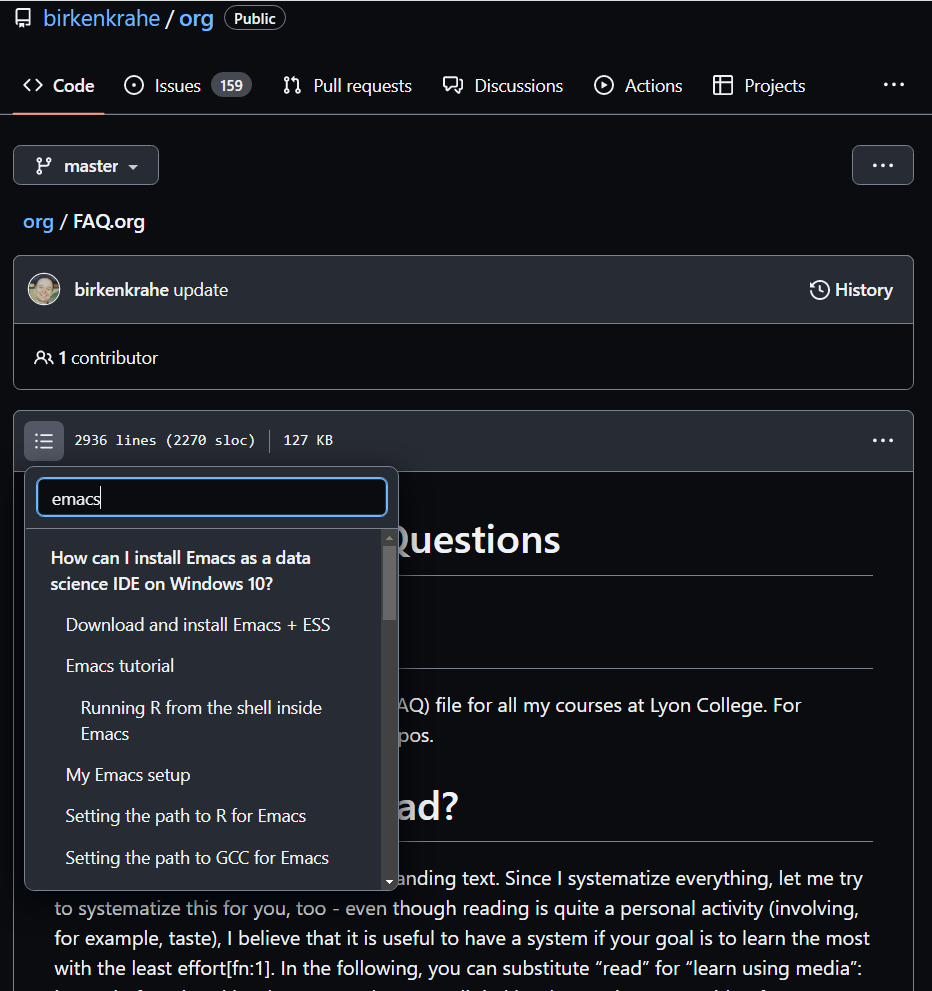

# Glossary / Emacs cheat sheet

Here is the [PDF version of the cheat sheet](https://github.com/birkenkrahe/cc/blob/piHome/pdf/emacs.pdf).

<table border="2" cellspacing="0" cellpadding="6" rules="groups" frame="hsides">

<colgroup>
<col  class="org-left" />

<col  class="org-left" />
</colgroup>
<thead>
<tr>
<th scope="col" class="org-left">TERM/KEY</th>
<th scope="col" class="org-left">Meaning</th>
</tr>
</thead>

<tbody>
<tr>
<td class="org-left">buffer</td>
<td class="org-left">holds text</td>
</tr>

<tr>
<td class="org-left">minibuffer</td>
<td class="org-left">messages and input</td>
</tr>

<tr>
<td class="org-left">mode line</td>
<td class="org-left">buffer information</td>
</tr>
</tbody>

<tbody>
<tr>
<td class="org-left"><code>C-x C-f</code></td>
<td class="org-left"><code>find-file</code></td>
</tr>

<tr>
<td class="org-left"><code>C-x i</code></td>
<td class="org-left"><code>insert-file</code></td>
</tr>

<tr>
<td class="org-left"><code>C-g</code></td>
<td class="org-left"><code>keyboard-quit</code></td>
</tr>

<tr>
<td class="org-left"><code>C-x C-s</code></td>
<td class="org-left"><code>save-buffer</code></td>
</tr>
</tbody>

<tbody>
<tr>
<td class="org-left"><code>C-a</code>, <code>C-e</code></td>
<td class="org-left">start, end of line</td>
</tr>

<tr>
<td class="org-left"><code>C-f</code>, <code>C-b</code></td>
<td class="org-left"><code>forward-char</code>, <code>backward-char</code></td>
</tr>

<tr>
<td class="org-left"><code>M-f</code>, <code>M-b</code></td>
<td class="org-left"><code>forward-word</code>, <code>backward-word</code></td>
</tr>

<tr>
<td class="org-left"><code>M-&lt;</code>, <code>M-&gt;</code></td>
<td class="org-left">beginning, end of buffer</td>
</tr>
</tbody>

<tbody>
<tr>
<td class="org-left"><code>M-q</code></td>
<td class="org-left"><code>fill-paragraph</code></td>
</tr>

<tr>
<td class="org-left"><code>C-x u</code></td>
<td class="org-left">undo last step</td>
</tr>

<tr>
<td class="org-left"><code>C-v</code>, <code>M-v</code></td>
<td class="org-left">scroll up, down</td>
</tr>

<tr>
<td class="org-left"><code>M-&lt;</code>, <code>M-&gt;</code></td>
<td class="org-left">top, bottom of buffer</td>
</tr>
</tbody>

<tbody>
<tr>
<td class="org-left"><code>C-SPC</code></td>
<td class="org-left">set mark (for region)</td>
</tr>

<tr>
<td class="org-left"><code>C-w</code> (<code>C-x</code>)</td>
<td class="org-left">cut/kill region (CUA)</td>
</tr>

<tr>
<td class="org-left"><code>C-y</code> (<code>C-v</code>)</td>
<td class="org-left">paste/yank region (CUA)</td>
</tr>

<tr>
<td class="org-left"><code>C-w</code> (<code>C-c</code>)</td>
<td class="org-left">copy region (CUA)</td>
</tr>
</tbody>

<tbody>
<tr>
<td class="org-left"><code>C-x 1</code></td>
<td class="org-left">current window only</td>
</tr>

<tr>
<td class="org-left"><code>C-x 2</code></td>
<td class="org-left">split window horizontally</td>
</tr>

<tr>
<td class="org-left"><code>C-x 3</code></td>
<td class="org-left">split window veritically</td>
</tr>

<tr>
<td class="org-left"><code>C-x o</code></td>
<td class="org-left">go to other window</td>
</tr>
</tbody>

<tbody>
<tr>
<td class="org-left"><code>C-x d</code></td>
<td class="org-left">list directories (<code>dired</code>)</td>
</tr>

<tr>
<td class="org-left"><code>C-x C-b</code></td>
<td class="org-left">list buffers</td>
</tr>

<tr>
<td class="org-left"><code>C-x b</code></td>
<td class="org-left">switch to (last) buffer</td>
</tr>
</tbody>

<tbody>
<tr>
<td class="org-left"><code>M-x eshell</code></td>
<td class="org-left">open (Linux-style) shell</td>
</tr>

<tr>
<td class="org-left"><code>C-c C-e</code></td>
<td class="org-left">open Org export dispatch</td>
</tr>

<tr>
<td class="org-left"><code>C-c C-v t</code></td>
<td class="org-left"><code>org-babel-tangle</code> file<a id="fnr.2" class="footref" href="#fn.2" role="doc-backlink">2</a></td>
</tr>

<tr>
<td class="org-left"><code>&lt;F6&gt;</code>, <code>&lt;F7&gt;</code></td>
<td class="org-left">display, hide inline files</td>
</tr>
</tbody>
</table>

# Acknowledgements

I'm indebted to Jacob Strickland and Jacob Wolfrom for testing the
first version, for their careful reading and for many comments that
helped improve this tutorial. Thanks to Natalie Packham for reminding
me of Eliza in Emacs (`M-x doctor`)!

# Footnotes

<a id="fn.1" href="#fnr.1">1</a> There are packages that make window movement easier - e.g. I
use the `ace-window` package. You can install and update Emacs packages
with the package manager (`M-x package-list-packages`).

<a id="fn.2" href="#fnr.2">2</a> This operation refers to extracting source code from a code
block. The header command `:tangle yes` has to be set.
