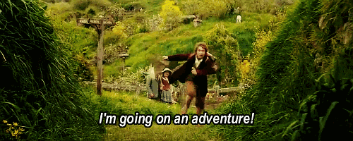

# I'm teaching the following courses in the summer and fall of 2022:

Contact me if you want details on any of these. I'm looking forward to seeing you in class!

-   Summer '22 - **Introduction to programming in C**. This course
    introduces you to programming using C. We cover C++ as an
    extension. C is a system programming language of pure power: it
    enables you to converse with the computer at a level unknown to
    users other high level languages many of which come from C. You
    also learn about: compilers, working on the command line, text
    editors Emacs, using C for Internet of Things (IoT) devices,
    cybersecurity, using pseudocode and process modeling. You get a
    foundation in critical thinking in concert with one of the three
    currently most popular languages (the other two are Python and
    Java). The course is for anyone who is interested in learning
    computational thinking and basic programming skills. You get:
    short lectures and practice sessions with interactive notebooks,
    weekly quizzes and program assignments. You'll learn some great
    tools: we use the "hacker's editor" Emacs, the world's foremost
    software engineering platform, GitHub, and SAP Signavio for
    process modeling. This course also prepares you for "Data
    structures with C++" (CSC 240) and "Algorithms" (CSC
    265). Prerequisites: none.

-   Fall'22 - **Snap! Programming Playground**. Create exciting games,
    animation and media computation, and learn computer and data
    science principles by playing with data. **What this is about.** In
    this course, you will complete a series of game and animation
    projects using the visual, drag-and-drop programming language
    Snap!  You will learn basic computer and data science principles,
    and understand how computers help us control the world around
    us. You will graduate from mere consumer and user to powerful
    programmer while playing around with blocks on the
    screen. Acquiring programming skills will help you develop your
    critical thinking. **What we will do.** We will meet weekly for
    practical problem solving and interactive exercises. In between
    classes, you will work on small assignments like this [Time
    Machine](https://snap.berkeley.edu/project?user=birkenkrahe&project=TimeMachine), and you will read short textbook chapters or watch short
    instructional videos. You'll get to present your own work and
    (optionally) publish your finished projects for the whole world
    to see, and if things go well, perhaps we'll go to Snap!Con in
    California next year! **Why you should do it.** This course is for
    you if you're curious about visual programming, if you don't know
    if working with computers is for you, or if you're interested in
    media, the arts, data, or in developing games. Snap! is also a
    great stepping stone to move on to higher languages like Python,
    R, C or C++. If you already have some knowledge of computing,
    programming or media computation, you'll be right at home and can
    add visual languages to your skillset. The course also serves as
    an easy entry into computer or data science degree programs.

-   Fall'22 - **Introduction to data science (DSC 105):** Data science is
    about how to get data to work for us, to give us its hidden
    treasures. Data science has been called "the sexiest job of the
    21st century". Even if you don't want to become a professional
    data scientist, it’s helpful to master the basic concepts if you
    want to succeed in today's highly data-driven business
    environment. This courses focuses on: data science basics,
    visualization and productivity tools. The course is for everyone
    who is interested in becoming more data literate and growing
    their skill stack. You get short lectures and practice sessions
    with interactive notebooks, weekly quizzes and
    assignments. You'll get a free subscription to the DataCamp
    learning platform. You'll learn some great tools: we use the
    "hacker's editor" Emacs, the world's foremost software
    engineering platform, GitHub, and the statistical programming
    language R, which is perfect for easy visualization of complex
    data stories. You show your skills as part of a capstone group
    project. Prerequisites: none. This course will be offered again
    in fall 2023.

-   Fall'22 - **Data visualization (DSC 302):** There are many tools and
    platforms out there to visualize patterns found in data and tell
    engaging, convincing stories. As a data scientist, you have to
    know what's out there, understand the principles of good visual
    presentation, and be able to customize plots quickly. In this
    course, we look at popular platforms like Tableau, PowerBi and
    even Excel, at languages like Snap! and Processing, and the R
    Shiny package that makes it easy to build interactive web apps
    straight from R.  The course is for everyone who is interested in
    becoming more data literate and growing their skill stack. You
    will get lectures, practice sessions with interactive notebooks
    and weekly quizzes. You'll get a free subscription to the
    DataCamp learning platform for assignments. We'll use Emacs, R,
    and other languages as needed. You will create and present your
    own visualizations as part of a capstone project. Prerequisites:
    introduction to programming (CSC 100 or CSC 115), or consent of
    the instructor. This course will be offered again in fall 2024.

-   Fall'22 - **Applied math for data science (CSC 482):** Data science
    is known to be math and stats heavy, but most of the math power
    is under the hood - you don't see much of it. This course will
    help you bridge the gap between what you already know and what is
    required to do exploratory data analysis. In this class, real
    datasets are used extensively, and all work is supported by R
    coding. We cover applications like PCA, mixture distributions,
    random graph models, Hidden Markov models, linear and logistic
    regression, Monte Carlo simulations, and neural networks. The
    course leads the student to think critically about the how and
    why of probability and statistics, and to see the big
    picture. The course is not theorem/proof oriented.  picture."
    You will get lectures, practice sessions with interactive
    notebooks (in Emacs) and weekly quizzes. You will work on a term
    project alone or in a group that you will present. Prerequisites
    are calculus, some matrix algebra, and some experience in
    programming (it doesn't need to be R). This course is
    cross-referenced as a math special topics course (MTH 445). This
    course will be offered again in fall 2024.

-   Fall'22 - **Internship course:** An internship can be an important
    "rite of passage", allowing you to test your skills in a real
    work environment. It can help you to find out who you are, what
    you want (or don't want) to do with your life and your education,
    it tests your assertiveness and networking skills, professional
    attitude,punctuality, stamina leadership issues, and much
    more. This course was designed to support you during your
    internship and help you make the most of the experience. We will
    meet weekly for one hour of discussion, you will write a weekly
    short (150 words) blog on GitHub, and briefly present your
    internship. Prerequisites: none. This course is offered every
    term.

