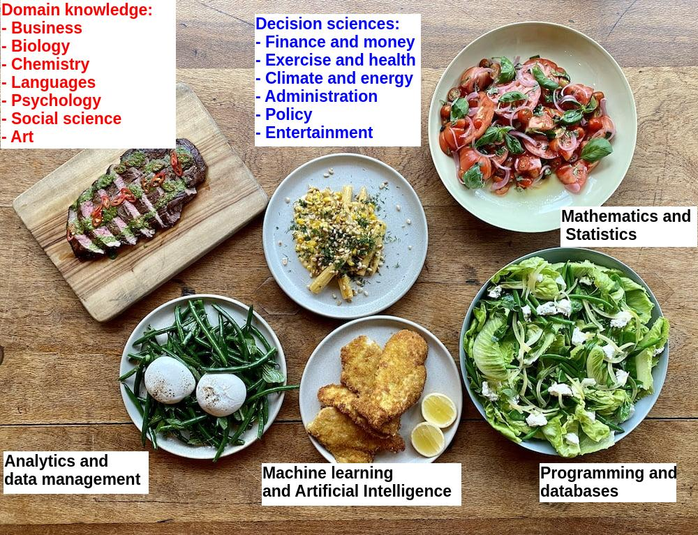
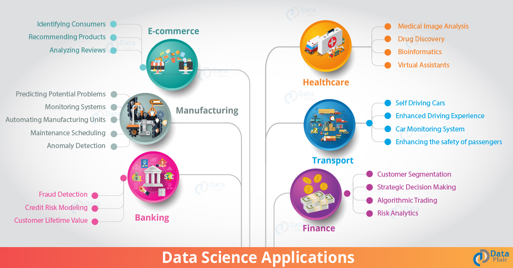
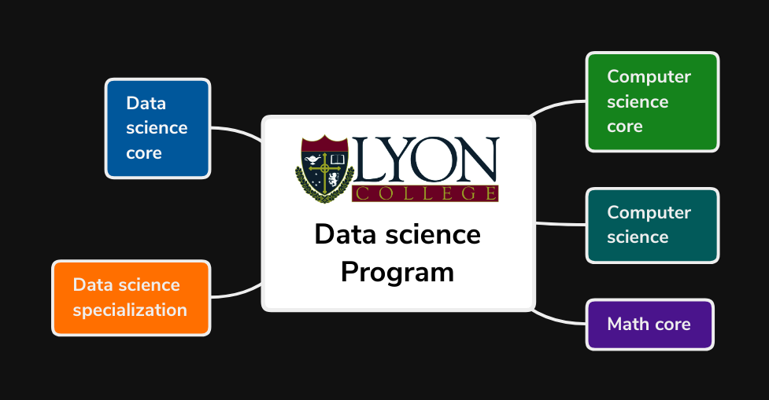
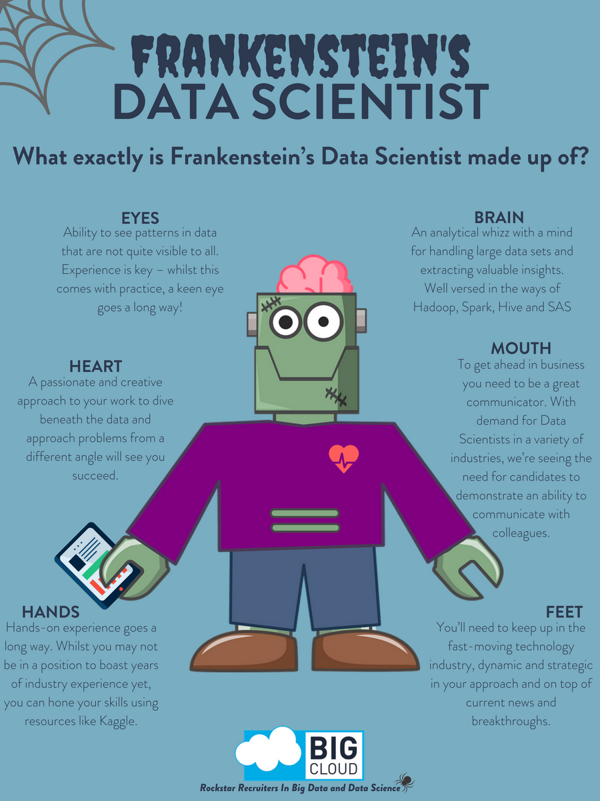

# What will you learn?

-   What is data science?
-   Why is data science so popular?
-   Which skills do you need/breed?
-   Current data science program at Lyon
-   Future of the data science program
-   Student profiles

# What is data science?

[RAW] **DATA** + [CODE] + **SCIENCE** [METHODS] = **VALUE**

# Why is data science so popular?

> 1.  Supply: social media obsession
> 2.  Demand: consumer convenience

## Why is data science so popular?

> 1.  Supply: patterned problems
> 2.  Demand: machine learning

# Which skills do you need/breed?

<table border="2" cellspacing="0" cellpadding="6" rules="groups" frame="hsides">

<colgroup>
<col  class="org-left" />

<col  class="org-left" />
</colgroup>
<thead>
<tr>
<th scope="col" class="org-left">SKILL</th>
<th scope="col" class="org-left">CHARACTER</th>
</tr>
</thead>

<tbody>
<tr>
<td class="org-left">Visualization</td>
<td class="org-left">Communication</td>
</tr>

<tr>
<td class="org-left">Critical thinking</td>
<td class="org-left">Curiosity</td>
</tr>

<tr>
<td class="org-left">Modeling</td>
<td class="org-left">Concepts</td>
</tr>

<tr>
<td class="org-left">Coding</td>
<td class="org-left">Process</td>
</tr>
</tbody>
</table>

These can come from varying backgrounds, and they are useful in all
professions, from insurance to intramurals.

## Data science applications

# Data science at Lyon

## Potential changes (from Fall 2022)

<table border="2" cellspacing="0" cellpadding="6" rules="groups" frame="hsides">

<colgroup>
<col  class="org-left" />

<col  class="org-left" />
</colgroup>
<thead>
<tr>
<th scope="col" class="org-left">CHANGE</th>
<th scope="col" class="org-left">AUDIENCE</th>
</tr>
</thead>

<tbody>
<tr>
<td class="org-left">Specializations</td>
<td class="org-left">Business/Economics</td>
</tr>

<tr>
<td class="org-left">&#xa0;</td>
<td class="org-left">Exercise Science</td>
</tr>

<tr>
<td class="org-left">&#xa0;</td>
<td class="org-left">Athletics / Sports</td>
</tr>

<tr>
<td class="org-left">Startup incubator</td>
<td class="org-left">Local business</td>
</tr>

<tr>
<td class="org-left">&#xa0;</td>
<td class="org-left">Students</td>
</tr>

<tr>
<td class="org-left">Game development</td>
<td class="org-left">Liberal arts</td>
</tr>

<tr>
<td class="org-left">&#xa0;</td>
<td class="org-left">Esports</td>
</tr>
</tbody>
</table>

# Student profiles

# Thank you! Questions?

