# Table of Contents

1.  [What is in this repo?](#org5b06919)
2.  [What should you do next?](#orgabef6b0)
3.  [What is this course about?](#orgcc513b4)
4.  [What's the format of the course?](#org70adac9)
5.  [What do you have to do to pass?](#org106c103)
6.  [What should you write in the blog posts?](#org17b1e49)
7.  [Will there be any lectures?](#org5c7da4c)
8.  [Where should you post the blog posts?](#org419a277)
9.  [What if your internship does not 100% overlap with the term?](#org42fd5df)
10. [What's the difference between junior/senior interns?](#orgdcd31d4)
11. [What should you present, and for how long?](#orgba44052)
12. [Where should we compose our blog posts?](#org621afdf)
13. [Who is your lecturer and supervisor?](#org78f91a4)
14. [What's with the sailing boats?](#org202dba6)
15. [References](#orgde74c6d)

# What is in this repo?

-   Frequently Asked Questions (FAQ)
-   Folders for weekly blogs
-   Publications/bookmarks
-   Last update: January 13, 2021

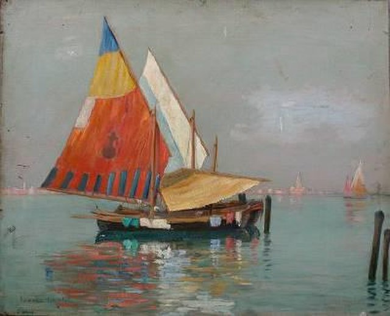

# What should you do next?

-   Create a GitHub account and let me know your user name<a id="fnr.1" class="footref" href="#fn.1" role="doc-backlink">1</a>
-   Accept my invitation as a collaborator in this repo
-   Complete the "Hello-World" tutorial (ca. 30 min)
-   [Optional] Fork this repo to your account (keep it "private")
-   Watch this repo ("All activity")
-   [Optional] Fetch weekly upstream updates
-   Merge your updates (= blog posts) into the repo<a id="fnr.2" class="footref" href="#fn.2" role="doc-backlink">2</a>

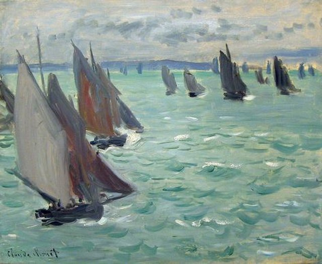

# What is this course about?

-   This course will support you during your internship.
-   We meet in the classroom for check in and presentations<a id="fnr.3" class="footref" href="#fn.3" role="doc-backlink">3</a>.
-   You blog weekly and discuss your experiences.

## Objectives

This is course is designed to:

-   Keep you connected to the school during your internships.
-   Teach you assertiveness skills and concepts which you can use to
    improve your internship experience and get the most out of it.
-   Help you learn to formulate your goals and set boundaries in
    work situations and conflicts.
-   Keep you focused on your next career steps.
-   Create and maintain a network between each other and your
    internship places that will enable you to support each other
    through the internship and form a basis of their future
    professional networks.

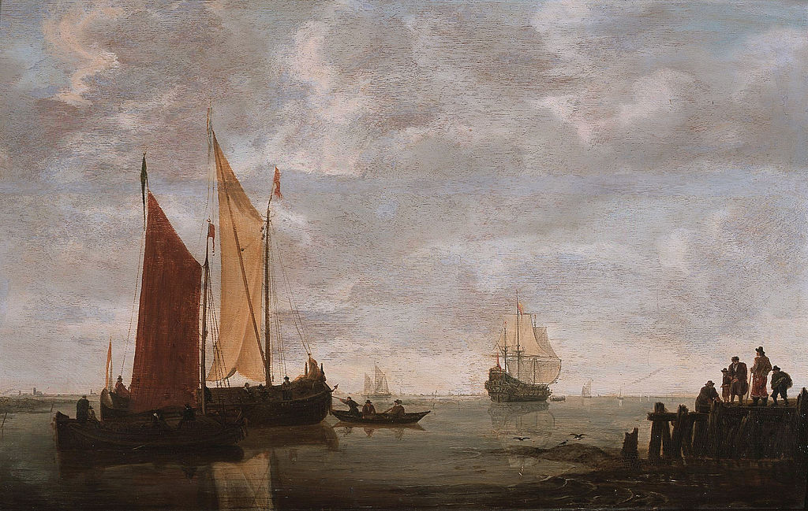

# What's the format of the course?

## History of the course

This course has a substantial history - I first started supporting
interns virtually, i.e. at a distance, in 2011. Over the years, I
used a plethora of platforms, including 3D worlds (Second life<a id="fnr.4" class="footref" href="#fn.4" role="doc-backlink">4</a>),
Adobe Connect, Big Blue Button and Moodle.

## Meetings

-   We're going to meet every week for an hour.
-   Every week we'll have a short presentation and a discussion.
-   Presentations will be topical, and related to the internship.
-   It'll be relaxed, and systematic, calm, and enriching.

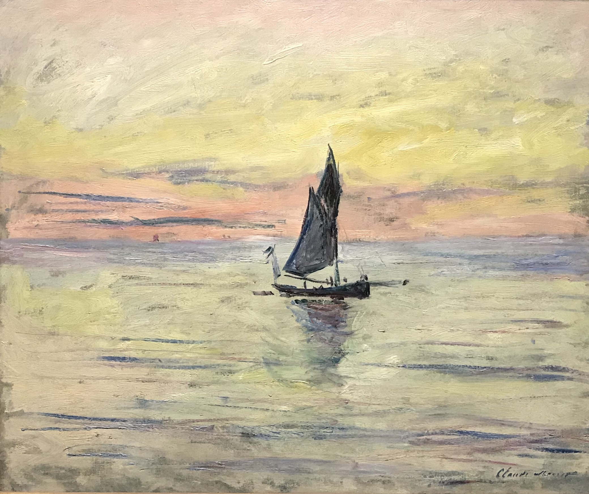

# What do you have to do to pass?

-   Present (your internship) at least once during the term
-   Actively participate in discussions (during class meetings)
-   Submit your weekly blog posts on time<a id="fnr.5" class="footref" href="#fn.5" role="doc-backlink">5</a>
-   Attend all meetings

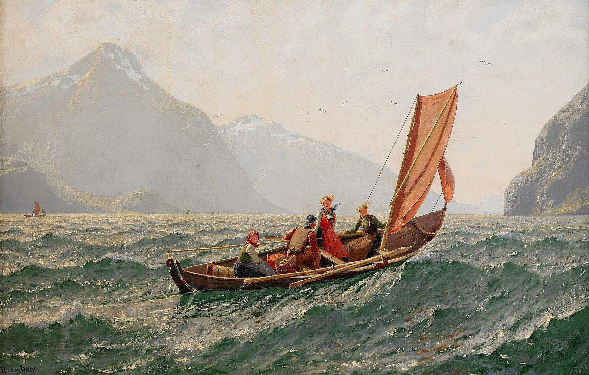

# What should you write in the blog posts?

There are a few rules, and a few themes.

## Rules

The weekly blog posts have a theme. Let it inspire you. There are
four small rules:

-   The blog post must have a recognizable link to the topic of the
    week.
-   The blog post must not have fewer than 150 words<a id="fnr.6" class="footref" href="#fn.6" role="doc-backlink">6</a>.
-   The blog posts must be submitted on time (deadline: Sunday 23:59
    hrs).
-   In your own interest, do not name organizations or people in your
    blog posts<a id="fnr.7" class="footref" href="#fn.7" role="doc-backlink">7</a>.

## Themes

The weekly themes are as follows:

1.  Your hiring process
2.  Your first impressions
3.  Your internship goals
4.  Your internship system
5.  Your work culture
6.  Your assertiveness
7.  Your networking
8.  Your work values
9.  Your work hierarchy
10. Your skills
11. Your accomplishments
12. Your career aspirations

Each blog post is introduced briefly in the [blogs folder](https://github.com/birkenkrahe/internship/tree/main/blogs).

.jpg)

# Will there be any lectures?

I usually open a session with a mini lecture on a topic related to
the next blog post, or to issues of general importance to young
professionals. These topics include:

-   Storytelling in organisations
-   Assertiveness in the workplace
-   Digitization of business
-   Time management
-   The two cultures
-   Leadership and coaching

I've been a few times around the block in science, business, IT, and
academia, so I've got a lot of topics of potential interest to
career starters. If something else interests you, ask and I might be
able to give a lecture on it!

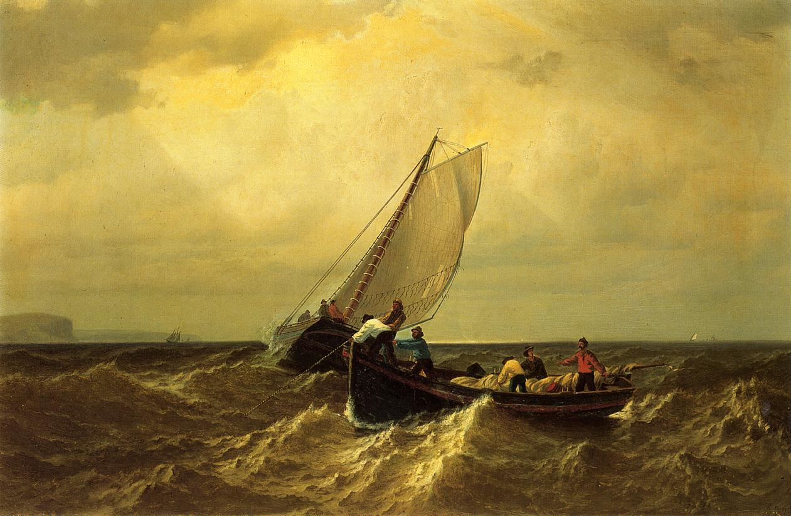

# Where should you post the blog posts?

Once you've joined this repo as a collaborator, you can upload your
blog post to the respective folder for the blog posts of that
week. This won't allow us to discuss online, but I find the GitHub
discussion forums too unwieldy.

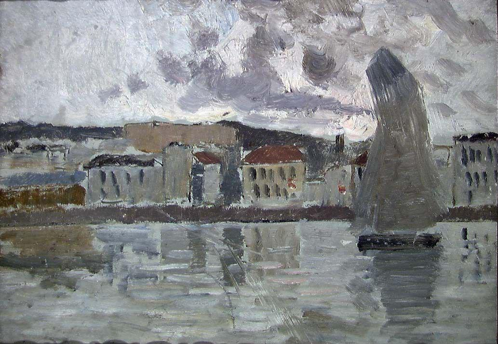

# What if your internship does not 100% overlap with the term?

If your internship began before the term or ends after the term, you
still need to participate in meetings, present and write blog posts.

More specifically, if you cannot say anything about a particular
weekly theme because you are not in an internship (anymore),
"simulate" the experience. Examples:

-   Hiring process: you should have started it. If this is not the
    case, you should not be on this course.
-   First impressions: what would you like your first impressions of
    the job to be? What are you looking for (in terms of first
    impressions)?
-   Internship goals: you should have goals for the internship even
    without having landed an internship yet.
-   Internship system: this the system, or set of routines, or ways,
    in which you go about achieving your goals. If you don't have an
    internship yet, then make plans for such a system!
-   Work culture: what culture would you like?
-   Assertiveness: can be covered independent of the internship,
    because assertiveness shows up in all human relationships.
-   Networking (with other interns): how do you network now with other
    students? Any ideas how to do that, or experiences from the past?
-   If you don't have an internship after this point (2 months into the term), you should not be on the course, or you should come talk to me and perhaps we can figure something out in connection with the practice office (talk to them first).

If your internship starts after the middle of the term (fall break -
early October), we may need to talk.

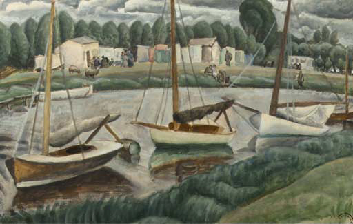

# What's the difference between junior/senior interns?

For the purpose of this course, we don't make a difference, except
that senior interns should perhaps take more of a leadership role in
the course, and share their experiences, ideas and insights for the
benefit of junior interns.

# What should you present, and for how long?

## Rules

-   You need to present your internship at least once during the
    term.
-   Present for 15-20 minutes followed by discussion.
-   Present your internship as best as you can.
-   Use slides and upload them (as a PDF) [here](https://github.com/birkenkrahe/internship/tree/main/pdf).
-   Schedule your presentation at least 2 weeks in advance<a id="fnr.8" class="footref" href="#fn.8" role="doc-backlink">8</a>.
-   What is presented and discussed in the class stays in the class.

## Content

In your presentation, include answers to:

-   How did you get this internship?
-   What does your company or organisation do?
-   What is your internship job about? What do you do?
-   What do you like about your internship?
-   What do you not like about your internship?<a id="fnr.9" class="footref" href="#fn.9" role="doc-backlink">9</a>
-   What advice have you got for other students?
-   Which questions have you got for others?<a id="fnr.10" class="footref" href="#fn.10" role="doc-backlink">10</a>
-   What is special about you?
-   When will you be done?
-   What do you hope to take away from this internship?

Don't do this just because you have to - take it as an opportunity
to learn and share important information about yourself, about the
job, about the business.

For example, one student, whose job it was to analyze data using
SQL queries, created an online form with a poll for his class
mates, which he turned on the fly into a table and analyzed it in
front of their eyes - demonstrating both what he had learnt and
what he was doing all day.

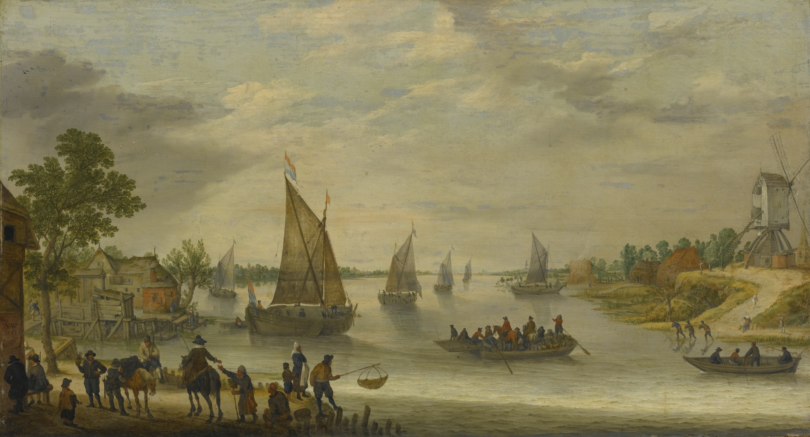

# Where should we compose our blog posts?

I suggest you do not write straight into GitHub but compose your
post elsewhere, in an editor, and then paste it here<a id="fnr.11" class="footref" href="#fn.11" role="doc-backlink">11</a>. Why?

-   It's more professional (being efficient and professional are
    sometimes at odds - writing and coding are two of these areas).
-   You make fewer mistakes and you leave a better impression because of it.
-   You don't run risk of losing your post if anything crashes.
-   You can think it over before  posting<a id="fnr.12" class="footref" href="#fn.12" role="doc-backlink">12</a>.
-   You have less qualms deleting stuff (copy-editing) than when you
    compose in the medium where the post will be published.

I especially recommend writing by hand and then copying it into an
editor. In my experience, anything written by hand is more
connected, feels more connected, is more powerful and easier to
remember and talk about than if you type stuff into the computer
right away. This is (probably) not true for code (I'm not so sure).

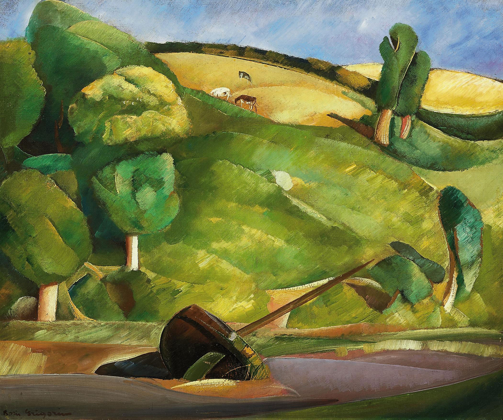

# Who is your lecturer and supervisor?

## Brief bio

Visiting Associate Professor of Data Science at Lyon College
since 2021. Professor of business informatics at HWR Berlin
since 2007. PhD in theoretical physics (1994). Executive at
Accenture and Royal Dutch Shell (1995-2002). Executive Coach,
lecturer and consultant (2003-2006). Favorite hobbies: coding (R),
gaming (PS4). Favorite authors: Henry James, Fjodor Dostoyevsky,
Theodor Fontane. Favorite films: Pride & Prejudice, Key Largo,
LOTR, Oblivion. Favorite series: Person of Interest, Rick & Morty,
IT Crowd. Favorite Games: Sekiro, Fallout 4, No Man’s Sky, AC
Valhalla. Favorite software: Emacs, Org-mode, GNU/Linux,
R. Favorite constant: Sommerfeld's constant (≈1/137). Favorite
number: `NaN`.

## Social media

This is a big name for not much time that I'm spending on social
media nowadays. With my transition to the U.S., I'll be even less
around online - except on GitHub (which is where you're now).

[LinkedIn](https://www.linkedin.com/in/birkenkrahe) | [Twitter](https://twitter.com/birkenkrahe) | [Researchgate](https://www.researchgate.net/profile/Marcus_Birkenkrahe) | [Blog](https://birkenkrahe.com/wordpress) | [Instagram](https://www.instagram.com/just_gidding/) | [About.me](https://about.me/birkenkrahe)

# What's with the sailing boats?

-   I like paintings of sailing boats!
-   It's a reminder that all images that you use (in your blog posts
    or in your presentations) must be properly referenced (e.g. in
    [Harvard citation style](https://www.easybib.com/guides/citation-guides/harvard-referencing/how-to-reference-an-image-harvard/)).
-   It's a reminder that you must have the copyrights for the
    image<a id="fnr.13" class="footref" href="#fn.13" role="doc-backlink">13</a>. It is not Okay to just take any old picture without
    worrying about your copyrights!

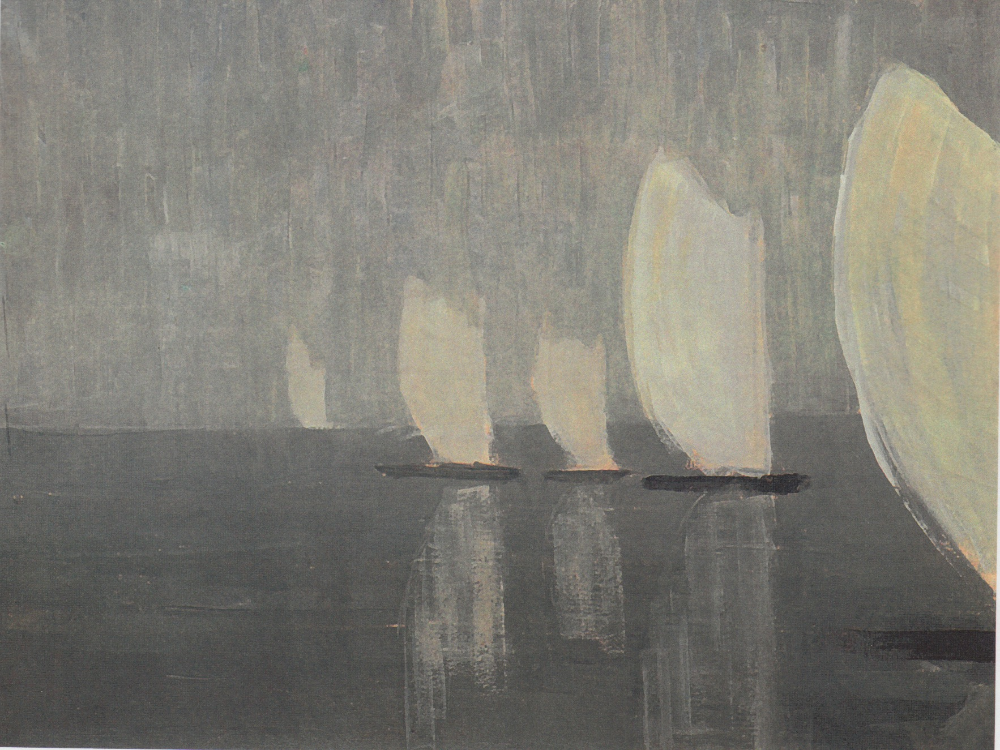

# References

## Image references

-   Burchard Galleries Inc (n.d.). *Lionel Walden (-1933): Sailing
    Boats* [Photograph]. Online: [Wikimedia Commons](https://commons.wikimedia.org/wiki/File:Lionel_Walden_-_Sailing_Boats.jpg). ([5](#org4699a83))
-   flickr (8 August 1868). *Claude Monet: Sailing Boats
    at Sea* [Photograph]. Online: [Wikimedia Commons](https://commons.wikimedia.org/wiki/File:Monet_Sailing_Boats_at_Sea_w125.jpg). ([13](#org9a72f67))
-   Museum of King Jan III’s palace at Wilanów (n.d.). *Simon
    de Vlieger (1600-1653)* [Photograph]. Online:
    [Wikimedia Commons](https://commons.wikimedia.org/wiki/File:Vlieger_Sailing_boats.jpg). ([23](#org0ab3b0e))
-   [Dudva](https://commons.wikimedia.org/wiki/User:Dudva) (4 December 2018). *Claude Monet: Sailing Boat, Evening
    Effect (1885)* [Photograph]. Online: [Wikimedia Commons](https://commons.wikimedia.org/wiki/File:Claude_Monet_-_Sailing_Boat,_Evening_Effect.jpg). Copyright: [CC
    BY-SA 4.0](https://creativecommons.org/licenses/by-sa/4.0)<a id="fnr.14" class="footref" href="#fn.14" role="doc-backlink">14</a> .  ([29](#orge062d3a))
-   [ARCADJA](http://www.arcadja.com/auctions/en/) (28 May 2008). *Hans Dahl (1849-1937): Fjord with
    sailing boat* [Photograph]. Online: [Wikimedia Commons](https://commons.wikimedia.org/wiki/File:Hans_Dahl_-_Fiord_with_sailing_boat.jpg) ([34](#orgdbd4059))
-   [Christie's](https://en.wikipedia.org/wiki/Christie%27s) (1977-1998). *Christoffer Wilhelm Eckersberg
    (1783-1853): A Sailing Boat in full sail* [Photograph] Online:
    [Wikimedia Commons](https://commons.wikimedia.org/wiki/File:Christoffer_Wilhelm_Eckersberg_-_A_Sailing_Boat_in_full_sail_(1832).jpg). ([55](#org6771eb8))
-   allartpainting.com (n.d.). *William Bradford (1823-1892): Fishing
    Boats on the Bay of Fundy* [Photograph] Online: [Wikimedia Commons](https://commons.wikimedia.org/wiki/File:William_Bradford_Fishing_Boats_On_The_Bay_Of_Fundy.jpg).
    ([64](#org1651007))
-   [National Museum of Art, Architecture and Design](https://www.nasjonalmuseet.no//en/collection/object/NG.M.01248) (n.d.) *Frits
    Thaulow: Norwegian Bokmål: Seilbåten* [Photograph]. Online:
    [Wikimedia Commons](https://commons.wikimedia.org/wiki/File:Frits_Thaulow_-_The_Sailing_Boat_-_NG.M.01248_-_National_Museum_of_Art,_Architecture_and_Design.jpg). ([66](#orgd56e0ef))
-   [Christie's](https://en.wikipedia.org/wiki/Christie%27s) (n.d.). *Leo Gestel (-1941): Sailing boats in a
    canal* [Photograph]. Online: [Wikimedia Commons](https://commons.wikimedia.org/wiki/File:Leo_Gestel_Sailing_boats_in_a_canal.jpg). ([78](#org32f4e1a))
-   [Uriel1022](https://commons.wikimedia.org/wiki/User:Uriel1022) (2013). *Wang Chiu-chiang: Sailing Boats on an Autumn
    River* [Photograph]. Online: [Wikimedia Commons](https://commons.wikimedia.org/wiki/File:Sailing_Boats_on_an_Autumn_River.jpg). Copyright: [CC BY-SA 4.0](https://creativecommons.org/licenses/by-sa/4.0)
    ([80](#org9ff9a36))
-   [Sotheby's](http://www.sothebys.com/) (31 January 2013). *Adam Willaerts (1577-1664): River
    scene with boats.* [Photograph]. Online: [Wikimedia Commons](https://commons.wikimedia.org/wiki/File:Adam_Willaerts_River_Scene_with_Boats.jpg). ([100](#org3fce3e8))
-   [Christie's](https://www.christies.com/lot/lot-boris-grigoriev-sailing-boat-in-a-cubist-5380031/?from=searchresults&intObjectID=5380031&sid=5445fdc4-5e52-4de0-9171-907d56e9e152) (2010). *Boris Grigoriev (1886-1939): Sailing boat
    in a cubist landscape* [Photograph]. Online: [Wikimedia
    Commons](https://commons.wikimedia.org/wiki/File:Boris_grigoriev_sailing_boat_in_a_cubist_landscape.jpg). ([108](#org55a7eeb))
-   [Google Art Project](https://www.google.com/culturalinstitute/asset-viewer/zwG0Ib0V-EZa5g) (n.d.). *Homer Winslow (1836-1910): The Boat
    Builders* [Photograph]. Online: Wikimedia
    Commons. ([112](#orga289f94))
-   [ciurlionis.eu](http://ciurlionis.eu/en/painting/gallery/) (5 March 2012). *Mikalojus Konstantinas
    Čiurlionis (1906): Sailing Boats* [Photograph]. Online:
    [Wikimedia Commons](https://commons.wikimedia.org/wiki/File:Mikalojus_Konstantinas_Ciurlionis_-_SAILING_BOATS_-_1906.jpg). ([116](#orgfae66b8))

# Footnotes

<a id="fn.1" href="#fnr.1">1</a> Feel free to use any user name. You should not have to use your
real name online unless you explicitly want to do it.

<a id="fn.2" href="#fnr.2">2</a> You can do this simply by uploading your file into the
respective remote folder, or by using GitHub remotely. How to do this
is explained in this [mindmap](https://github.com/birkenkrahe/internship/blob/main/img/Using_GitHub_remotely.png) ([XMind](https://github.com/birkenkrahe/internship/blob/main/mindm/Using%20GitHub%20remotely.xmind)). Details in class.

<a id="fn.3" href="#fnr.3">3</a> Frequency and dates to be determined. Sessions will last ca. one
hour.

<a id="fn.4" href="#fnr.4">4</a> This particular platform was fun. Read more about it in this
paper: written with my former student A Gallo: Birkenkrahe, M., Gallo,
A. (2011). Transfer Of Physical Classroom Techniques To The Virtual
Classroom During a Practice Supervision Course. In: Journal of Virtual
Studies March 2011. ([PDF](https://github.com/birkenkrahe/internship/blob/main/pub/birkenkrahe_gallo_2011.pdf))

<a id="fn.5" href="#fnr.5">5</a> If you miss a blog post (no word limit), you must submit a
substitute essay of no less than 1000 words in the following week.

<a id="fn.6" href="#fnr.6">6</a> That's not a lot of words. Here is an example of 150 words exactly:

> »It's strange to supervise this course though I have never been in an
> internship myself. Still, supervising young interns for years has
> given me some insight, and I have worked around people for many more
> years. Which is to say that I know how to behave myself, how to
> network, how to be assertive, and which skills are useful to get on in
> life (or at least some of them - you can never have enough!). Also, I
> am a certified psychotherapist, I have been an executive, lead teams,
> and I have coached executives for a number of years. Even better than
> all of the experience and the certificates, and the age is the fact
> that, as a researcher and scientist, I know some models and systems
> that work universally when you're in trouble. So all in all I would
> say I'm not the absolutely worst choice as an internship supervisor.«

<a id="fn.7" href="#fnr.7">7</a> The GitHub repo is private and only accessible to other interns,
but it is professional and generally smart, not to divulge personal
information on the net. Since we meet personally, save specific issues
or grievances for the classroom meetings.

<a id="fn.8" href="#fnr.8">8</a> When you've scheduled a presentation, I will create a folder in
`pdf/` with your name where you can upload your material.

<a id="fn.9" href="#fnr.9">9</a> Here you should be specific and yet professional. Specific,
because otherwise we won't know what you mean, and professional,
because it's the Internet, and everything is out in the open.

<a id="fn.10" href="#fnr.10">10</a> These could be closed questions (suited for a poll), or open
questions, better suited for discussion.

<a id="fn.11" href="#fnr.11">11</a> You'll sometimes, when I present, see my own editor, which is
fantastic - it's the Swiss army knife of editors, and I have used it
for the past 35 years (since my own student days)! It's called Emacs
and you can use it to: 1) organize your life, 2) write and edit, 3)
publish and present, 4) many other things. See: [Getting started with
Emacs](https://opensource.com/article/20/3/getting-started-emacs) (2020), and/or ask me for a demo or details.

<a id="fn.12" href="#fnr.12">12</a> I am terrible at that myself - I always post before thinking
things through and end up reposting and editing too many times. One
time is too many! Don't make that mistake, too!

<a id="fn.13" href="#fnr.13">13</a> This sounds easier than it is: obtaining proper copyright
information usually involves a little detective work, sometimes a lot
of it. In this case, all images come from Wikimedia Commons, and they
are explicitly in the public domain, or I have given the proper
(creative commons) licensing information. You can only leave this
information out if you created the image yourself (and had the right
to create it, if it is a photograph of someone else's work).

<a id="fn.14" href="#fnr.14">14</a> This is an example for a "creative commons" licence. Follow the
link and check it out. You might, one day, want to licence your own
creative work, too.
